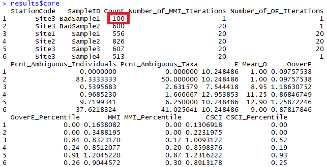
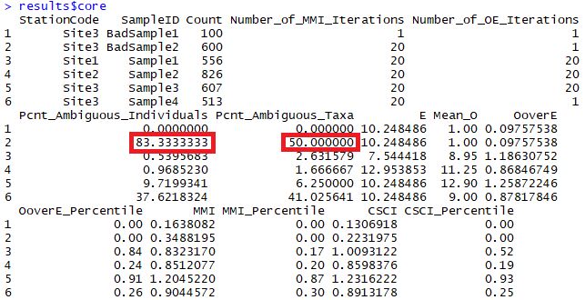
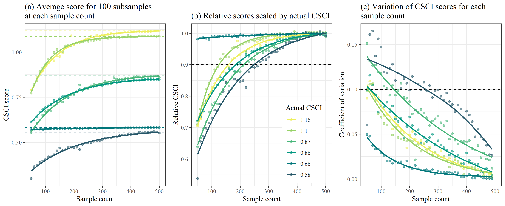
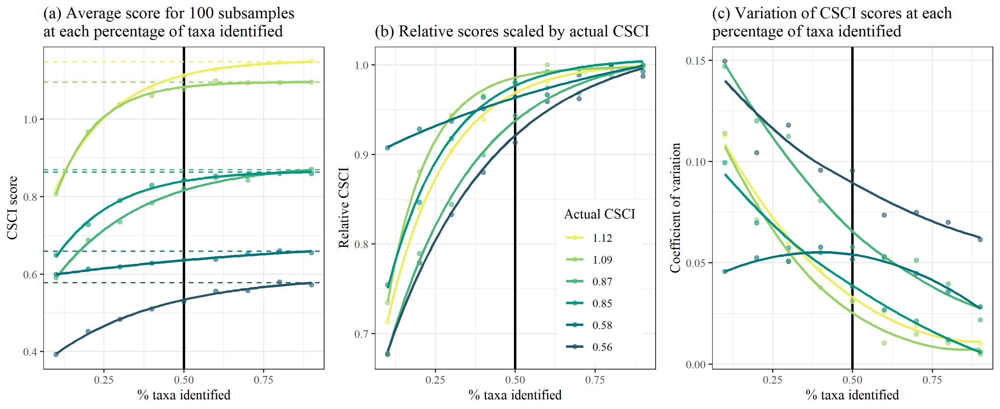

```{r, setup, echo = FALSE, message = FALSE, warning = FALSE}
knitr::opts_chunk$set(
  collapse = TRUE,
  warning = FALSE,
  message = FALSE,
  echo = FALSE,
  comment = "#>",
  fig.path = "../figures/"
)

library(here)
library(tidyverse)

# # extract bib entries from online
# Jabbrev::bib_scrp(
#   here('analysis/paper', 'decision_framework_SOP.Rmd'),
#   here('analysis/paper', 'refs.bib'),
#   ext_bib = 'https://raw.githubusercontent.com/fawda123/refs/master/refs.bib'
# )

# # check spelling
# spelling::spell_check_files(here('analysis/paper', 'decision_framework_SOP.Rmd'))

devtools::load_all('.', quiet = T)
```

# Background

The California Stream Condition Index or CSCI is a robust tool for evaluating the biological integrity of streams in California using aquatic insect as indicators of stream health [@Mazor16].  The CSCI is used in routine assessments conducted by the San Gabriel River (SGR) Regional Monitoring Program, a copperative non-governmental organization that manages aquatic resources in the watershed.  CSCI data collected by the SGR Regional Monitoring Program are the most comprehensive sources of information on biological condition of streams in the region.  Established field sampling protocols are in place to ensure that the data are sufficient to provide an accurate representation of biological communities to evaluate with the CSCI. 

In many places, SGR managers lack the context for a biological condition assessment to determine the likelihood of a site for achieving biological integrity.  For example, managers may expect a mountain stream in the upper watershed to have greater biological potential than an urban stream in the lower watershed.  Many stream reaches with low CSCI scores occur in developed urban and agricultural landscapes, where restoration can be costly and it may be difficult to achieve regional reference-like conditions.  In these situations, identifying a context for what CSCI scores are expected under current landscape conditions could be helpful for identifying where management actions are most likely to achieve intended outcomes, or where landscape alteration could limit success in achieving biological integrity.  Conversely, identifying locations where biological condition exceeds the expectation could be prioritized for conservation.  

The landscape model was developed to predict an expected range of CSCI scores relative to the level of landscape alteration that occurs in a watershed [@Beckir].  This model was applied to monitoring sites in the SGR  waterhsed to identify stream reaches that are constrained for achieving a potential biological objective for the CSCI.  Local managers are already using the landscape model with CSCI scores to prioritize sites for different management actions. For example, sites where observed scores are outside the predicted ranges from the landscape model could receive a high priority for follow-up actions, such as additional monitoring, casual assessment, or restoration. 

Before additional actions are pursued at high priority sites, a reasonable level of confidence is needed in the sample used to estimate the CSCI and the stream classification from the landscape model.  Samples may not be reliable if standard sampling procedures are not followed or abnormal environmental events affect a sample, producing a CSCI score that does not represent baseline conditions. Similarly, landscape model results may not be reliable if the spatial data used to create the classification do not represent current conditions at a site.  A *validation process* is needed at high priority sites to verify the following:

* Is the biological sample used to calculate the CSCI reliable and within the standard protocol for estimating a site score?
* Does the constraint class defined by the landscape model reflect the actual landscape context for these sites?
* What data can we use and what questions can we ask to assess the validity of a bioassessment sample and stream class?

This document provides a set of questions to consider when evaluating the validity of the CSCI or landscape model results at high priority sites. The validation process is organized hierarchically from low to high effort, starting with the simplest questions that are easy to answer and should be evaluated with any assessment.  High effort questions are those that may require additional data that may be more difficult to acquire, or the certainty of the conclusions may require some level of professional judgment.  

Most importantly, this document is not a validation of the CSCI as an index or the SCAPE model; rather it is a validation of the usefulness of the sample used to estimate the CSCI score, or the SCAPE model outputs at the site in question. There are no policy recommendations herein for what makes a sample and/or score valid; validation should be part of normal QA/QC.  Lastly, the document does not provide specific recommendations on what management actions are pursued after validation occurs.

# Validation

## Workflow description

Validation is the process of confirming validity of a CSCI score and stream channel classification from the landscape model.  A "valid" CSCI score or classification is determined from professional judgment after reviewing appropriate data as being a sufficient description of the biological condition or constraint class, respectively, within the limits of the methods used to estimate each component. Validation is also within the larger framework of comparing CSCI scores to results form the landscape model to develop priorities, such that high priority sites identified through this process should undergo validation prior to follow-up actions.  The validation process ends with a determination on whether or not the CSCI score and/or landscape model classification are sufficiently accurate to warrant follow-up management actions. 

```{r valflo, fig.cap="A simplified framework for validating CSCI and landscape model (LSM) information.", fig.height=3}
knitr::include_graphics('../figures/simp_temp.png')
```

The conceptual framework for the validation process is shown in Figure \@ref(fig:valflo).  High priority sites are first identified by comparing CSCI scores to expectations from the landscape model. Validation can occur if a site is considered high priority, which may be a site that has a CSCI score that is not within the expected range.  If the site is otherwise low priority, then baseline monitoring and maintenance should be continued.  For high priority sites, the validation process is shown in the light grey box.  

Separate but parallel validation processes occur for the CSCI score and landscape model classification. In both validation processes, questions vary in the level of difficulty to answer regarding validity of the CSCI sample or SCAPE ouput.  Difficulty can very either because the data to address the question may or may not be readily available or the certainty of the conclusion can vary because of incomlete knowledge about how much the issue affects the outcome. Questions are generally organized in the section below from simple/easy to answer vs more difficult questions that may require some level of professional judgement. 

A CSCI score or landscape model classification can be invalidated at any step in the validation process.  A final conclusion is that one or both of the results are invalidated and that more data may be needed, which can include a site visit to collect information or to verify existing data.  Once new data are obtained or existing data are confirmed, the validation process is reinitiated.  The process occurs iteratively until both the CSCI score and landscape model result are sufficiently validated, i.e., the analyst has confidence the results of both are sufficient for pursuing follow-up actions. If both are validated, the validation process is finished and additional actions can be pursued, which may include rapid causal analysis to determine why biological condition differs from the expectation. If it is not possible to validate the information with additional data, the analyst can also decide to proceed with follow-up actions regardless of the results.  In other words, the analyst may decide to trust the results based on their professional judgment, regardless of what the validation process provided.  
    
## CSCI validation

The following is a list of questions to consider when validating a CSCI score.  Each question focuses on a specific issue that may influence a CSCI score outside of the standard operating procedure for the index.  These questions correspond to the left track of the validation box in Figure \@ref(fig:valflo). For each question, a description is provided for why the the question or issue is a problem, followed by a description of what data do you need or where to you look to determine if the problem applies to your sample.  A CSCI score could be invalidated for one to any of the questions and it is up to the analyst to determine when to stop considering additional questions.

### Is the sample count sufficient? 

*Why is this a problem?* 

Low sample counts may not provide a complete picture of the community that was present during sampling. Sample counts could be low for several reasons, including but not limited to sampling failure (e.g., loss of insects from net failure), poor timing of sampling (e.g., outside of index period), or sampling protocols from the field manuals were not followed.  Macroinvertebrate data used to calculate the CSCI are based on a representative subsample of 600 individuals from the total sample for each site.  In general, sites where CSCI scores are based on substantially less than 600 individuals may be suspect.  

*Where do you find an answer?*

The index output that is generated by the CSCI calculator (<https://sccwrp.github.io/CSCI>) provides information that can be used to evaluate the sample count.  Specifically the "core" output contains a column for each CSCI sample for the sample count.  In the first row, we see that the first sample was based on only 100 organisms.  Therefore, we can assume that CSCI scores from the first sample are likely invalid.
   
```{r fig.cap = "CSCI metadata that can be evaluated from the standard results.  The first sample returns an invalid CSCI score because of a low sample count (in red)."}

```

The SWAMP program does not provide guidance on how many samples are required.  However, an analysis of the effect of systematically reducing the sample count well below 600 individuals for several sites is provided in the appendix.  Figure \@ref(fig:smpeff) was created by taking subsamples of the total sample size for six different sites with a range of CSCI scores (horizontal dashed lines in Figure \@ref(fig:smpeff)a).  For each sample count, 100 subsamples were randomly selected from the total and CSCI scores were summarized by the average and coefficient of variation.  Overall, reducing the sample size caused reductions in the CSCI scores, with the reductions increasing more quickly with smaller sample sizes.  Figure \@ref(fig:smpeff)b shows the relative change as a proportion from the actual CSCI score.  The CSCI score is within ten percent of the actual score with sample counts of around 250 or more.  CSCI scores were reduced by greater than ten percent of the actual score with lower sample counts, the exception being a site with very low diversity. The variation of CSCI scores for each sample count also increases with lower sample counts (Figure \@ref(fig:smpeff)c), although variation did not exceed ten percent until very low sample sizes (e.g., 150 or less).  

Based on the above analyses, we recommend a minimum sample size of 250 for a valid sample. Detailed recommendations are as follows:

* CSCI scores are generally within ten percent of the actual with sample counts of 250 or more

* Changes in CSCI score with lower samples are similar for high or low quality sites, however; 

* Sites with very ow scores and very low richness are minimally affected by changes in sample counts.

* Precision decreases with lower sample size, although variation is typically less than 10% of the true mean with sample sizes of 200 or more.

### Are there many ambiguous individuals or taxa? 

*Why is this a problem?* 

Ambiguous individuals or taxa cannot be used for O/E calculations in the CSCI, and may distort calculations of some metrics. This might occur if, for example, a sample isn’t identified to the CSCI’s standard level of taxonomic effort (SAFIT1a), or if the sample is dominated by immature or hard-to-identify taxa (e.g., early instar stoneflies) . In these cases, a lower sample count of unambiguous individuals is used to calculate CSCI scores, which may not reflect true site condition.

Although the effect of ambiguous individuals or taxa on the CSCI may be similar to the effects of low sample count, the underlying reason for depressed CSCI scores is different. In the former case, taxa used to calcuate the CSCI sample lack specificity and certain traits that are diagnostic for specific metrics may be impossible to quantify.  Even if the sample is truly diverse and has a sufficiently high sample count, designations at higher taxonomic levels may not provide enough detail to fully characterize biological condition. 

*Where do you find an answer?*

The taxonomic identifications for macroinvertebrate samples used to calculate the CSCI are compared against SAFIT's standard taxonomic effort (available at [https://safit.org/ste.html](https://safit.org/ste.html)).  The CSCI output returns information on the percentage of a sample that does not conform to the SAFIT taxonomy, both as the percentage of **individuals** from the total count that are ambiguous and the percentage of **taxa** that are ambiguous.  Although no maximum number has been established by SWAMP, samples with high percentages of ambiguous taxa may have invalid CSCI scores. Figure \ref(fig:coreex2) shows output from the CSCI calculate that reports the percentage of ambiguous individuals and taxa.  The second sample for site 3 has many ambiguous observations.

```{r coreex2, fig.cap = "CSCI metadata that can be evaluated from the standard results.  The second sample returns an invalid CSCI score because of many ambiguous individuals and taxa (in red)."}

```

The effect of systematically increasing the amount of ambiguous taxa on CSCI scores is shown in the appendix.  Figure \@ref(fig:smpamb) was created by increasing the amount of ambiguous taxa that were included in each sample.  Ambiguous taxa were introduced by replacing individuals in the sample that had known identifications with the taxonomic Order.  By doing so, species were combined into larger groups at the Order level and discarded from the CSCI sample if the Order could not be resolved for any metric calculations.  An increasing number of ambiguity was evaluated ranging from 10% (right side of plots) to 90% ambiguous (left side of plots).  For each level of percent ambiguity (or percent taxa identified), 100 samples were evaluated where a different set of individuals were randomly selected to replace with the Order.  As before, the results in the plots represent the average CSCI score for the 100 random samples (Figures \@ref(fig:smpamb)a,b) and the coefficient of variation associated with the 100 random samples (Figures \@ref(fig:smpamb)c).

Based on the above analyses, we recommend a maximum percentage of ambiguous taxa not to exceed  40-50% (i.e., percent of identified taxa not to fall below 50-60%).  Details include:

* Increasing ambiguity caused a decrease in CSCI scores from the true estimates

* CSCI scores are generally within ten percent of the actual if the ambiguous taxa are less than 50-60% of the total sample

* Precision decreases with more ambiguous taxa, although variation is typically less than 10% of the true mean if at least 30-40% of the sample contains unambiguous taxa.

### Was the sample affected by unusual sampling conditions? 

CSCI scores may be invalid if the sample was affected by natural or temporary disturbances.  The SWAMP sampling protocol indicates that sampling should occur during normal, baseflow conditions [@Ode16b].  Sampling outside of these conditions, even during the normal index period from May to September, may result in depressed CSCI scores.  Field notes may indicate if abnormal conditions were present.  External datasets, such as flow records or time and location of fire events, may also provide clues of abnormal conditions. Types of disturbances could include: 

1) Abnormal flow
     * high flow after a rain event that can scour a stream channel
     * high flow dam release or diversion
     * low flow under drought conditions
1) Vector control operations at/upstream of a site or in the watershed
1) In channel vegetation management or debris removal 
1) Fire location and intensity

It is also important to note that the CSCI is sensitive to stressors that may be caused by unusual events and that the score is valid in these instances, although it is not representative of "normal" conditions.  Whether or not a CSCI score is valid after a temporary disturbance depends on the objective of the sampling.  If the sampling is meant to capture the effects of these events, then the score is more than likely valid.  However, if the objective is to evaluate "normal", long-term conditions at a site, then the score may not represent these baseline conditions.  In the latter case, field crews may or may not be aware of temporary events that can depress CSCI scores.  If there is reason to question a score based on an unusual sampling condition, external data must be consulted. Field notes may be the best source of information.

### Was the sample outside of the typical index period?

The SOP guidelines for field sampling of macroinvertebrates [@Ode16b] states the typical index period as being from __May__ through __September__ to characterize base flow conditions.  This period depends on the region, such that sampling can occur towards the earlier end of this range in southern California, and later in this range for higher latitudes.  Sampling that occurs outside of this range could produce a sample that is not representative of the macroinvertebrate community for which the CSCI is calculated.  Sample dates can be verified from the raw data used to calculate the CSCI.  However, ad hoc information has suggested that CSCI scores are relatively invariant to seasonal changes, so this question is given a lower priority for validation. 

### Does the site have a bad watershed delineation?

The CSCI requires data describing landscape characteristics of the watershed for a site.  These data are used to develop a prediction of the macroinvertebrate community that could be expected at the site under reference conditions.  A watershed delineation is required for a site to obtain these landscape data for the CSCI predictions. The CSCI interim instructions [@Mazor18b] describe in detail how these delineations can be created.  In short, a digital elevation model is used with the site's longitude/latitude to identify the area of land where all elevations are increasing and higher than the starting elevation of the site.  This watershed is then used to calculate landscape-level data needed for the CSCI, such as the total elevation range, average precipitation, and various soil characteristics.  An inaccurate representation of the watershed can produce inaccurate estimates of the landscape data used to calculate the CSCI.

The watershed delineation process is partially automated using standard geospatial software, with some intervention and manual inputs from the analyst.  In general, delineations will accurately represent the watershed at the site if: 

* The actual site location is spatially co-located with a stream reach line in a GIS, and vice versa.
* The actual drainage area is well-represented by topography. 

For the first scenario, the site location is typically referenced by longitude/latitude coordinates.  For delineation, these coordinates must be spatially linked to a stream reach in a GIS. Stream reaches are usually represented by the NHD-Plus dataset [@McKay12], which is a national-level product describing stream hydrography for the entire United States. The first step in the delineation is to "snap" the site location to the nearest stream reach.  If the site location is imprecise or was entered incorrectly, the snapping distance can be large.  Conversely, the stream reach in the NHD-Plus dataset may not accurately portray the true channel.  In either case, the resulting watershed will originate from a location that does not represent reality.  Visual assessment of the site location, the segment that was used for the delineation, and the snapping distance can provide clues about the quality of the delineation.  

For the second scenario, topographical characteristics of the landscape around a site can also affect the quality of the delineation.  In general, watershed boundaries are more easily identified at high gradient sites in hilly or mountainous areas where topographical variation is more pronounced.  Conversely, low gradient streams may have less accurate watershed delineations because it is more difficult to identify clear elevation differences that define drainage patterns.  The latter scenario is more common in coastal plains, plateaus, or other low elevation areas.  Developed landscapes also complicate watershed delineations because the flow of water may have been significantly altered from natural patterns.  In these cases, water may not follow strict topographical boundaries due to channelization or diversions. Overlaying the watershed delineation on aerial photos can provide clues about the effect of land use alteration on flow patterns and if the delineation is well-represented by topography.   

The original GIS file for the watershed delineation should be viewed to assess the relative quality.  If this file is unavailable, the [Streamstats](https://streamstats.usgs.gov/ss/) website can provide some clues about the watershed delineation.  Figures \@ref(fig:delinex) provides examples of two extremes when watershed delineations can be produced with differing quality.  Figure \@ref(fig:delinex)a shows a high gradient stream in a mountainous, undeveloped area.  In this scenario, the topography is sufficiently pronounced to easily identify the watershed boundaries and the hydrological flow follows the landscape.  Conversely, figure \@ref(fig:delinex)b shows a low gradient stream in an urban setting. The watershed boundaries are not easily identify from elevation gradients and the digitized stream channels probably do not accurately reflect the flow of water in this altered landscape. 

```{r delinex, fig.cap = 'Watershed delineation examples.'}
knitr::include_graphics(here('analysis/figures', 'delinex.png'))
```

### Are there unusual settings where the CSCI is known to give low scores?

There are a few locations in California where the CSCI scores may be unreliable, although they are not formally documented nor well understood.  In these locations, scores may be depressed because the biological community may be naturally low in diversity and the reference pools do not account for these localized exceptions.  For example, the geological setting may be uncharacteristic of the region (e.g., unusual geology types with limited extent, [@Campbell09]).  This can influence the physical and chemical characteristics of the stream that structure the diversity of the biological community.  This confounds the ability of the CSCI to distinguish between natural and anthropogenic variation, resulting in unreliable scores.  

Local site knowledge from field crews could provide information on abnormal locations where the biological expectations are naturally different from other streams in the region. In most cases, field crews will likely already be aware of locations where standard bioassessment methods produce odd or unexpected results compared to other locations.  Detailed geological maps may also provide clues regarding localized environmental differences that could influence the score.  

## Landscape model validation

The landscape model validation questions correspond to the right track of the grey validation box in Figure \@ref(fig:valflo).

### Questions

1) Is the sampling reach atypical of a channel's overall class (e.g., unconstrained class surrounded by constrained classes)?

The landscape model assigns a constraint class to digitized reaches in the NHD-Plus stream hydrography layer.  A reach can be described as one of four classes: likely constrained, possibly constrained, possibly unconstrained, likely unconstrained.  Typically, stream reaches of the same class co-occur in space such that it is more likely that a constrained reach is surrounded by other constrained reaches and an unconstrained reach is surrounded by other unconstrained reaches. Occasionally, a stream segment will have a constraint class that differs or is otherwise unexpected based on the classes for reaches nearby.  For example, an unconstrained reach may be found in an urban setting where reaches upstream and downstream are constrained.  This could reflect a real phenomenon or could be an artifact of the data.  In these cases, the constraint class should be investigated. 

Viewing an aerial image of land use for a site is the easiest way to assess the validity of an unexpected stream class.  As an example, the online [SCAPE](https://sccwrp.shinyapps.io/scape) application provides this information for the San Gabriel River Watershed. Figure \@ref(fig:scapex) was taken from SCAPE and shows a stream reach that is assigned a class of likely unconstrained.  All of the surrounding reaches are possibly or likely constrained.  Without looking at the land use, we might assume that this constraint class is invalid (Figure \@ref(fig:scapex)a). We can toggle the base layer to show a satellite image of the location to get a better idea of the landscape (Figure \@ref(fig:scapex)b).  From the satellite image we can see that this reach drains a small undeveloped, hilly area upstream of the housing units.  With this information we can assume that the constraint class is valid because it accurately reflects land use in the watershed.

```{r scapex, fig.cap = "An unexpected stream class is validated by examining the land use, lane cover base layer."}
knitr::include_graphics(here("analysis/figures", "scapex.png"))
```

For locations not in the San Gabriel watershed, a [shapefile](https://knb.ecoinformatics.org/view/urn:uuid:75411f50-32ed-42a5-bbfd-26833c7a441f) is available for all stream reaches in California where the landscape model was applied.   

2) Has land cover recently changed?

The landscape model provides an expectation of biological condition based on the landscape characteristics of the watershed upstream of a site.  The landscape characteristics are based on national-level, geospatial data products that characterize the relative extent human development in the watershed.  Specifically, the landscape model is based on StreamCat data [@Hill16] that provide estimates of canal/ditch density, imperviousness, road density/crossings, and urban/agricultural land use for each site.  Within StreamCat, many of these estimates were derived from primary data products, such as the National Land Cover Database for 2006 and 2011 (Table \@ref(tab:crvr)).  Because some of the primary products relate to a specific year, the associated constraint classes from the landscape model may not accurately reflect current constraints.  

```{r crvr, tidy = F}
# streamcat variables used in core models
nms <- c("CanalDens", "PctImp2006", "TotUrb2011", "TotAg2011", "RdDens", "RdCrs")
scl <- c('Cat, Ws', 
         'Cat, Ws, Cat + Rp100, Ws + Rp100',
         'Cat, Ws, Cat + Rp100, Ws + Rp100',
         'Cat, Ws, Cat + Rp100, Ws + Rp100',
         'Cat, Ws, Cat + Rp100, Ws + Rp100',
         'Cat, Ws'
)
         
dsc <- c(
  'Density of NHDPlus line features classified as canal, ditch, or pipeline',
  'Mean imperviousness of anthropogenic surfaces (NLCD 2006)',
  'Total urban land use as sum of developed open, low, medium, and high intensity (NLCD 2011)',
  'Total agricultural land use as sum of hay and crops (NLCD 2011)',
  'Density of roads (2010 Census Tiger Lines)',
  'Density of roads-stream intersections (2010 Census Tiger Lines-NHD stream lines)'
)
unt <- c('km/sq km', '%', '%', '%', 'km/sq km', 'crossings/sq km')
totab <- data.frame(nms, scl, dsc, unt) %>% 
  dplyr::rename(Name = nms, Scale = scl, Description = dsc, Unit = unt)
# table stuff
cap.val <- 'Land use variables used to develop the landscape model.  All variables were obtained from StreamCat [@Hill16] and applied to stream segments in the National Hydrography Dataset Plus (NHD-plus) [@McKay12].  The measurement scales for each variable are at the riparian (100 m buffer), catchment, and/or watershed, scale relative to a stream segment.'

# table
knitr::kable(totab, booktabs = T, caption = cap.val)
```

There is no quantitative approach to verify if the constraint class accurately reflects the current landscape.  However, the constraint class is typically an accurate representation of the current landscape because land use changes that affect stream biology usually occur over time scales much longer than would be expected between present day and the data used to create the model.  However, in some cases, local alteration of the landscape can occur rapidly and at a scale sufficient to affect stream condition.  For example, construction of a parking lot adjacent to a stream channel could alter drainage patterns sufficiently to affect stream health.  If there is sufficient evidence that recent changes may be affecting biology and that the current constraint class is not an accurate representation of biological expectations, additional data may be consulted.  

The Google Earth (<https://www.google.com/earth/>) time slider provides a useful tool to evaluate temporal changes in land use over time that could be affecting a site.  The slider can be used to view a current image and any of a number of images of land use and cover for the past twenty years.  Figure \@ref(fig:luchng) shows a screen shot from SCAPE for a current image, including some stream channels in the possibly unconstrained class.  In the left image for current conditions, we see a parking lot adjacent to the stream channel.  Using Google Earth, we can view an image from 2008 to see that this parking lot was not yet constructed.  Because our land use data used to calibrate the model correspond roughly to this time period in the right image, this stream channel may be incorrectly classified.  The channel may be more accurately described as constrained. A site visit could also confirm this information.

```{r luchng, fig.cap = "An example from SCAPE showing (a) unconstrained channels next to a parking lot and (b) the same location approximately ten years ago.  Note the absence of the larger parking lot in the earlier photo."}
knitr::include_graphics(here('analysis/figures', 'luchng.png'))
```

3) Are there constraints not captured by the landscape model that are affecting biology at the site?

As noted in the previous question, the landscape model was calibrated using large-scale watershed characteristics (Table \@ref(tab:crvr)) that are unlikely to change dramatically over most management time scales (e.g., five to ten years).  In some instances, there may be constraints affecting biology at a site that are not captured by the model.  Many of these constraints may be short-lived or temporary disturbances that fall under the same category as those for question three for the CSCI questions (i.e., abnormal flow, fire, etc.).  The same approach to addressing validity of the CSCI score also applies to the landscape model classification.  Field notes or external datasets could be consulted to determine if the site classification is warranted.

A more general issue applying the landscape model is that other landscape stressors not captured by the model may have had a legacy or long-term impact on stream biology.  For example, in the Sierras or northern California, timber harvesting, silviculture, or mining may have had historical impacts on biology which are not reflected in the current model.  These legacy impacts might not be explicitly included in the landscape model and should be considered in the constraint classification if the current class does not accurately characterize biological expectations.  A first step is to evaluate the variables in Table \@ref(tab:crvr) and assess how well these variables capture stressor gradients at the site of interest.  If they are not appropriate, consider that the current classification is invalid and alternative ways to assess constraints could be used (e.g., what is the range of scores for other sites in similar conditions for the region).  

4) Do the spatial data for the stream channel match the actual location on the landscape? 

The landscape model assigns a constraint classification to every NHD-Plus stream reach where data are available.  Because of this, information from the landscape model is only as good as the spatial representation of stream locations in the hydrography dataset.  Stream reaches may not be good representations of the actual channel location if 1) the stream is in a landscape with altered hydrology, or 2) the stream channel has migrated over time due to normal hydro-geomorphic processes.  Figure \@ref(fig:hydroex) shows an example of where landscape model results are available, whereas the stream lines represent the challenges of digitizing actual stream channels in altered landscapes.  The actual stream channel that corresponds to the spatial data represented in the NHD-Plus should be compared to verify accuracy and if the results from the landscape model still apply.  

```{r hydroex, fig.cap = "Stream hydrography in altered lanscaped.  Actual stream reaches may not be well represented by existing spatial layers."}
knitr::include_graphics(here('analysis/figures', 'hydroex.png'))
```

5) Are the results from the landscape model close to key decision points?

As with many decision support tools, the constraint classifications derived from the landscape model are categories that are based on binning continuous data.  This approach allows complex information to be distilled for communication in a more digestible format.  This improvement in communication comes at the expense of specificity - binning results reduces the type of information that can be obtained.  As an example, the landscape model would classify a stream reach as possibly constrained if the median score is 1/100 of a decimal place below the biological objective, whereas increasing that score by 0.02 points would cause the landscape model to classify the reach as possibly unconstrained.  Because of this, an analyst should be aware of how the constraint classes are determined and if the results for a site are close to decision points.  

Figure \@ref(fig:scapemec) provides a graphical description of how the landscape constraint classes are determined.  Stream segments where the predicted 90th quantile score is below the biological objective threshold are considered likely constrained, whereas those where the predicted 10th percentile is above the threshold are considered likely unconstrained. Possibly constrained and possibly unconstrained are assigned if the score expectations overlap the biological objective and the median score is below or above the objective, respectively.

```{r scapemec, fig.cap = 'Decision points and methods for defining sream classifications from the landscape model.'}
knitr::include_graphics(here("analysis/figures", "scapemec.jpeg"))
```

Sites where the 10th, median, or 90th percentile of the score expectations are near the biological objective should be further evaluated.  Does the site classification change if slightly different breakpoints are used, such as the 5th or 95th percentile of scores?  Does the site classification change if the biological objective changes?  The online SCAPE application provides options to explore the effect on stream classifications when changing the main decision points.  If the stream class does not change with different decision points, then the the stream class is robust.  However, if small changes in decision points change the the stream class and different conclusions are made about biological expectation at a site, a judgment call can be made as to how much validity a stream class has for the particular reach. 

## Data sources

The following is a list of resources that can provide information to address the validation questions. 

* CSCI metadata (consult CSCI SOP and package documentation)
* SCAPE website
* Reference site information
* GIS data
  * StreamCat
  * NHD hydrography
  * Catchment/Watershed layers
  * LU/LC data - NLCD 2006, 2011, NAIP aerial imagery
  * GIS metrics for CSCI
  * Google imagery + time slider
* Field data
  * SWAMP, SMC, CEDEN 
* Local knowledge
  * Field notes
  * Site photos
* Additional external datasets
  * weather conditions (noaa.gov/weather)
  * Fire perimeters
  * Dredging data
  * Mining data
  * Timer harvest/silviculture data

# High priority sites in SGR watershed

* 405CE0280, SMC00480, SMC00144, SMC02972, SMC04524, SMC06496
* Why are these high priority?
* Validate CSCI/LSM results for each using available data to demonstrate the process
* What conclusions are made?  


# Appendix

```{r smpeff, fig.cap = "Effects of reducing sample size on CSCI scores."}

```

```{r smpamb, fig.cap = "Effects of introducing ambiguous taxa on CSCI scores."}

```

# References

