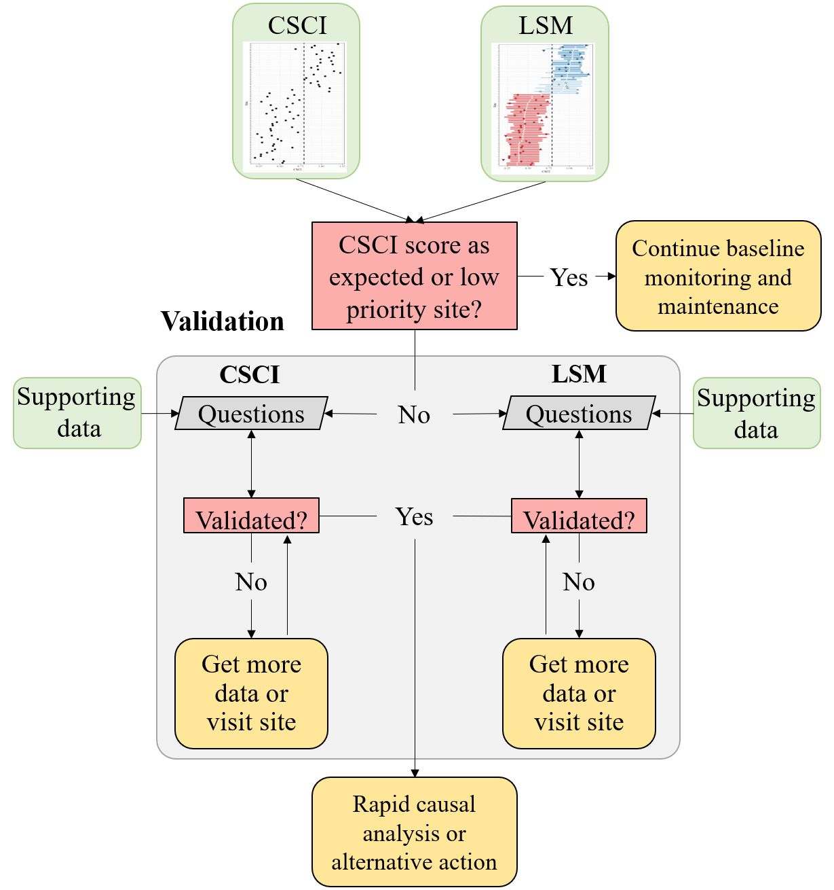

```{r, setup, echo = FALSE, message = FALSE, warning = FALSE}
knitr::opts_chunk$set(
  collapse = TRUE,
  warning = FALSE,
  message = FALSE,
  echo = FALSE,
  comment = "#>",
  fig.path = "../figures/"
)

library(here)
library(tidyverse)

# # extract bib entries from online
# Jabbrev::bib_scrp(
#   here('analysis/paper', 'decision_framework_SOP.Rmd'),
#   here('analysis/paper', 'refs.bib'),
#   ext_bib = 'https://raw.githubusercontent.com/fawda123/refs/master/refs.bib'
# )

# # check spelling
# spelling::spell_check_files(here('analysis/paper', 'decision_framework_SOP.Rmd'))

devtools::load_all('.', quiet = T)
```

# Background

* CSCI is the foundation of stream bioassessment in CA
     * Robust as an assessment method
     * May not be reliable if standard sampling or procedures are not followed, or external events affect a sample
     * We need an approach to determine if a particular sample cannot be reliably used with the CSCI

* The landscape model (LSM) provides a context for CSCI scores
     * What are constraints and how are they determined with the LSM
     * How can priorities be defined with the LSM
     * When would an assessment from LSM be unreliable? 

* We need to validate the information for high priority sites
     * Does the constraint class defined by the landscape model reflect the actual landscape context for these sites?
     * Is the biological sample used to calculate the CSCI reliable and within the standard protocol for estimating a site score?
     * What data can we use and what questions can we ask to assess the validity of a bioassessment sample and stream class?

* Who this document is for
     * Resource managers in SGRRMP
     * Resource managers elsewhere that might use CSCI/LSM to prioritize and have similar needs when interpreting bioassessment data
     * Assumes familiarity with CSCI and LSM, including interpretation of standard output

* What this document provides
     * Checklist of questions to evaluate for considering validity of CSCI and LSM scores
     * Organized in hierarchy from low to high effort, i.e., desktop exercise to collection/eval of external data, including additional site visits
     * A decision-support tool to help gather evidence for judgement calls by managers
     
* What this document is not
     * Not a validation of the CSCI as an index - it is a validation of the sample
     * Not a validation of LSM as a model - it is a validation of the data used to define the class
     * No policy recommendations for considering a sample/score valid, this is part of normal QA/QC
     * Does not define what action is pursued once CSCI/LSM are validated

# Validation

## Workflow description

* What is validation? 
    * General process of confirming validity of CSCI score and LSM category for guiding management decisions
    * Validation is within a larger framework that begins with comparing CSCI scores to LSM classification and ends with a decision on how to proceed (e.g., rapid screening for causal assessment, accept as is, collect more data)

```{r, fig.cap="A simplified framework for validating CSCI and SCAPE information.", fig.height=3}

```

* The workflow
    * Grey boxes: validation process
    * Green boxes: datasets
    * Pink boxes: decision nodes
    * Yellow boxes: validation outcomes

* Validation process
    * Evaluate both CSCI and LSM assessments
    * The assessment can be invalidated at any step, which may prompt collection of appropriate data
    * Validation priorities - consider the difficulty answering the question and the importance of the question (i.e., how badly does the information need to be verified to consider a score valid. 
    * Phase 1 validation - uses readily available data from CSCI output or SCAPE website, these are low effort questions
    * Phase 2 validation - requires evaluation of external datasets, including supporting GIS data, field information, etc., these are high effort questions

```{r, fig.cap="A simplified framework for validating CSCI and SCAPE information.", fig.height=1}
knitr::include_graphics('../figures/validation_priority.png')
```

<!-- The following is a list of several questions to consider when validating a CSCI score.  Each question focuses on a specific issue that may influence a CSCI outside of the standard operating procedure for the index.  For each question, a description of the issue is provided, how might the issue affect the score, and what data are needed to answer the question.  The questions are also described as simple desktop evaluations (e.g., examination of the metadata that are included with standard CSCI output) or more challenging questions may require additional data (e.g., site visits) or analyses to fully evaluate. A CSCI score could be invalidated for one to any of the questions and it is up to the individual to determine when to stop considering additional questions.        -->

* Types of recommended and required data
    * CSCI QAQC info
    * LSM QAQC info, SCAPE eval
    * Supporting data (external GIS, field data, etc.)
    
* Decisions determine if you continue validation or reach a validation outcome

* Validations outcomes: What decisions do you make once CSCI/LSM are/aren't validated? 
    * The CSCI score is as expected or the site is otherwise low priority - continue baseline maintenance and monitoring
    * Validated 
         * Conduct RSCA
         * Other alternative action
    * Not validated for CSCI or LSM
         * trust results anyway
         * get more samples
         * visit site
         
## Data sources

List of resources to assist with building the validation tool set - can go here or in appendix.

### Metadata 

* CSCI metadata (consult CSCI SOP and package documentation)
* SCAPE website
* Reference site information

### Supporting data

* GIS data
  * StreamCat
  * NHD hydrography
  * Catchment/Watershed layers
  * LU/LC data - NLCD 2006, 2011, NAIP aerial imagery
  * GIS metrics for CSCI
  * Google imagery + time slider
* Field data
  * SWAMP, SMC, CEDEN 
* Local knowledge
  * Field notes
  * Site photos
* Additional external datasets
  * weather conditions (noaa.gov/weather)
  * Fire perimeters
  * Dredging (?)
  * Mining (?)
  * Timer harvest/silviculture (?)
    
## CSCI

### Phase 1 questions 

The phase 1 questions are high priority, meaning they can be answered with minimal effort (e.g, by consulting the CSCI metadata) and the outcome has high certainty (e.g., a CSCI score will almost always be invalid if the results do not satisfy the question).

1) Is the sample count sufficient? 
  
Low sample counts may not provide a complete picture of the community that was present during sampling.  Macroinvertebrates data used to calculate the CSCI are based on a representative subsample of 600 individuals from the total sample for each site.  In general, sites where CSCI scores are based on substantially less than 600 individuals may be suspect.  

The index output that is generated by the CSCI calculator provides information that can be used to evaluate the sample count.  Specifically the "core" output contains a column for each CSCI sample for the sample count.  In the first row, we see that the first sample was based on only 100 organisms.  Therefore, we can assume that CSCI scores from the first sample are invalid.
   
```{r fig.cap = "CSCI metadata that can be evaluated from the standard results.  The first sample returns an invalid CSCI score because of a low sample count (in red)."}
knitr::include_graphics('../figures/coreex1.png')
```

There are no strict guidelines from the SWAMP program for how many samples are required, although 100 is wholly insufficient.  An analysis of the effect of systematically reducing the sample count well below 600 individuals for several sites is shown below.  

```{r smpeff, fig.cap = "Effects of reducing sample size on CSCI scores."}
knitr::include_graphics('../figures/summary_results.png')
```

Figure \@ref(fig:smpeff) was created by taking subsamples of the total sample size for six different sites with a range of CSCI scores (horizontal dashed lines in Figure \@ref(fig:smpeff)a).  For each sample count, 100 subsamples were randomly selected from the total and CSCI scores were summarized by the average and coefficient of variation.  Overall, reducing the sample size caused reductions in the CSCI scores, with the reductions increasing more quickly with smaller sample sizes.  Figure \@ref(fig:smpeff)b shows the relative change as a proportion from the actual CSCI score.  The CSCI score is within ten percent of the actual score with sample counts of around 250 or more.  CSCI scores were reduced by greater than ten percent of the actual score with lower sample counts, the exception being site 801M16861. The variation of CSCI scores for each sample count also increases with lower sample counts (Figure \@ref(fig:smpeff)c), although variation did not exceed ten percent until very low sample sizes (e.g., 150 or less).  

The following conclusions are made from Figure \@ref(fig:smpeff):

* CSCI scores are generally within ten percent of the actual with sample counts of 250 or more

* Sites with lower CSCI scores are more affected by lower sample counts, however; 

* Sites with low scores and very low richness are minimally affected by changes in sample counts (site 801M16861).

* Precision decreases with lower sample size, although variation is typically less than 10% of the true mean with sample sizes of 200 or more.

2) Are there many ambiguous individuals or taxa? 

Ambiguous individuals or taxa cannot be used for O/E calculations in the CSCI, and may distort calculations of some metrics. This might occur if, for example, a sample isn’t identified to the CSCI’s standard level of effort (SAFIT1a), or if the sample is dominated by immature or hard-to-identify taxa (e.g., early instar stoneflies) . In these cases, a lower sample count of unambiguous individuals is used to calculate CSCI scores, which may not reflect true site condition.

The taxonomic identifications for macroinvertebrate samples used to calculate the CSCI are compared against SAFIT's standard taxonomic effort (available at [https://safit.org/ste.html](https://safit.org/ste.html)).  The CSCI output returns information on the percentage of observations in a sample that do not conform to the SAFIT taxonomy, both as the percentage of **individuals** from the total count that are ambiguous and the percentage of **taxa** that are ambiguous.  Although no maximum number has been established by SWAMP, samples with high percentages may have invalid CSCI scores. 

```{r fig.cap = "CSCI metadata that can be evaluated from the standard results.  The second sample returns an invalid CSCI score because of many ambiguous individuals and taxa (in red)."}
knitr::include_graphics('../figures/coreex2.png')
```

3) Was the sample affected by unusual sampling conditions? 

CSCI scores may be invalid if the sample was affected by natural or temporary disturbances.  The SWAMP sampling protocol indicates that sampling should occur during normal, baseflow conditions.  Sampling outside of these conditions, even during the normal index period from May to September, may result in depressed CSCI scores.  Field notes may indicate if abnormal conditions were present.  External datasets, such as flow records or time and location of fire events, may also provide clues of abnormal conditions. Types of disturbances could include: 

1) Abnormal flow
     1) high flow after a rain event that can scour a stream channel
     1) high flow dam release or diversion
     1) low flow under drought conditions
1) Vector control operations at/upstream of a site or in the watershed
1) In channel vegetation management or debris removal 
1) Fire location and intensity

It is also important to note that the CSCI is sensitive to stressors that may be caused by unusual events and that the score is valid in these instances, although it is not representative of "normal" conditions.  Whether or not a CSCI score is valid after a temporary disturbance depends on the objective of the sampling.  If the sampling is meant to capture the effects of these events, then the score is more than likely valid.  However, if the objective is to evaluate "normal", long-term conditions at a site, then the score may not represent these baseline conditions.  In the latter case, field crews may be unaware of temporary events that can depress CSCI scores.  If there is reason to question a score based on an unusual sampling condition, external data must be consulted. Field notes may be the best source of information.

### Phase 2 questions    

Phase two questions are more difficult to address because they may require additional, external datasets and/or there is no clear answer for what determines the validity of a CSCI score for the question.  In these cases, the analyst must determine for themselves what is sufficient evidence to invalidate a CSCI score.

1) Was the sample outside of the typical index period?

The SOP guidelines for field sampling of macroinvertebrates [@Ode16b] states the typical index period as being from __May__ through __September__ to characterize base flow conditions.  This period depends on the region, such that sampling can occur towards the earlier end of this range in southern California, and later in this range for higher latitudes.  Sampling that occurs outside of this range could produce a sample that is not representative of the macroinvertebrate community for which the CSCI is calculated.  Sample dates can be verified from the raw data used to calculate the CSCI.  However, published research has suggested that CSCI scores are relatively invariant to seasonal changes, so this question is giver a lower priority for validation. 

2) Does the site have a bad watershed delineation?

The CSCI requires data describing landscape characteristics of the watershed for a site.  These data are used to develop a prediction of the macroinvertebrate community that could be expected at the site under reference conditions.  A watershed delineation is required for a site to obtain these landscape data for the CSCI predictions. The CSCI interim instructions [@Mazor18b] describe in detail how these delineations can be created.  In short, a digital elevation model is used with the site's longitude/latitude to identify the area of land where all elevations are increasing and higher than the starting elevation of the site.  This watershed is then used to calculate landscape-level data needed for the CSCI, such as the total elevation range, average precipitation, and various soil characteristics.  An inaccurate representation of the watershed can produce inaccurate estimates of the landscape data used to calculate the CSCI.

The watershed delineation process is automated using standard geospatial software, with some intervention and manual inputs from the user.  In general, delineations will accurately represent the watershed at the site if: 

* The site location is spatially co-located with a stream reach, and

* The actual drainage area is well-represented by topography. 

For the first scenario, the site location is typically referenced by longitude/latitude coordinates.  For delineation, these coordinates must be spatially linked to a stream reach in a GIS.  These stream reaches are represented by the NHD-Plus dataset [@McKay12], which is a national-level product describing stream hydrography for the entire United States. The first step in the delineation is to "snap" the site location to the nearest stream stream reach.  If the site location is imprecise or was entered incorrectly, the snapping distance can be large.  Conversely, the stream reach in the NHD-Plus dataset may not accurately portray the true channel.  In either case, the resulting watershed will originate from a location that does not represent reality.  Visual assessment of the site location, the segment that was used for the delineation, and the snapping distance can provide clues about the quality of the delineation.  

For the second scenario, topographical characteristics of the landscape around a site can also affect the quality of the delineation.  In general, watershed boundaries are more easily identified at high gradient sites in hilly or mountainous areas where topographical variation is more pronounced.  Conversely, low gradient streams may have less accurate watershed delineations because it is more difficult to identify clear elevation differences that define drainage patterns.  The latter scenario is more common in coastal plains, plateaus, or other low elevation areas.  Developed landscapes also complicate watershed delineations because the natural flow of water may have been significantly altered.  In these cases, water may not follow strict topographical boundaries due to channelization or diversions. Overlaying the watershed delineation on aerial photos can provide clues about the effect of land use alteration on flow patterns and if the delineation is strongly driven by topography.   

The original GIS file for the watershed delineation should be viewed to assess the relative quality.  If this file is unavaialble, the [Streamstats](https://streamstats.usgs.gov/ss/) website can provide some clues about the watershed delineation.  Figures \@ref(fig:delinex) provides examples of two extremes when watershed delineations can be produced with differing quality.  Figure \@ref(fig:delinex)a shows a low gradient stream in an urban setting. The watershed boundaries are not easily identify from elevation gradients and the digitized stream channels probably do not accurately reflect the flow of water in this altered landscape. Conversely, figure \@ref(fig:delinex)b shows a high gradient stream in a mountainous, undeveloped area.  In this scenario, the topography is sufficiently pronounced to easily identify the watershed boundaries and the hydrological flow likely follows these boundaries.  

```{r delinex, fig.cap = 'Watershed delineation examples.'}
knitr::include_graphics(here('analysis/figures', 'delinex.png'))
```

3) Are there unusual settings where CSCI is known to give low scores?

There are a few locations in California where the CSCI scores may be unreliable, although they are not formally documented nor well understood.  In these locations, scores may be depressed because the biological communicity may be naturally low in diversity and the reference pools do not account for these localized exceptions.  For example, the geological setting may be uncharacteristic of the region (e.g., unusual geology types with limited extent, [@Campbell09]) and can have an influence on the physical and chemical characteristics of the stream that then limits diversity of the biological community.  This confounds the ability of the CSCI to distinguish between natural and anthropogenic variation, resulting in unreliable scores.  

Local site knowledge from field crews could provide information on abnormal locations where the biological expectations are naturally different from other streams in the region. In most cases, field crews will likely already be aware of locations where standard bioassessment methods produce odd or unexpected results compared to other locations.  Detailed geological maps may also provide clues regarding localized environmental differences that could influence the score.  

Data to evaluate

* Weather data
* Fire perimeters
* QA reports, CSCI metadata
* Field notes
* Upstream/downstream samples or nearby 
* ASCI, PHAB, CRAM, water quality observations
* Pictures
* Reference sites
* GIS data
* watershed data
* Degree of deviation from expectation

## SCAPE

### Phase 1 questions

The phase 1 questions are high priority, meaning they can be answered with minimal effort (e.g, by consulting the readily available data) and the outcome has high certainty (e.g., a landscape model score will almost always be invalid if the results do not satisfy the question).

1) Is the sampling reach atypical of a segment’s overall conditions (e.g., unconstrained surrounded by constrained)?

The landscape model assigns a constraint class to digitized reaches in the NHD-Plus stream hydrography layer.  A reach can be described as one of four classes: likely constrained, possibly constrained, possibly unconstrained, likely unconstrained.  Typically, stream reaches of the same class co-occur in space such that it is more likely that a constrained reach is surrounded by other constrained reaches and an unconstrained reach is surrounded by other unconstrained reaches. Occasionally, a stream segment will have a constraint class that different or otherwise unexpected based on the classes for reaches nearby.  For example, an unconstrained reach may be found in an urban setting where reaches upstream and downsream are constrained.  In these cases, the constraint class should be investigated. 

Viewing an aerial image of land use for a site is the easiest way to assess the validity of an unexpected stream class.  As an example, the online [SCAPE](https://sccwrp.shinyapps.io/scape) application provides this information for the San Gabriel River Watershed. Figure \@ref(fig:scapex) shows a stream reach that is assigned a class of likely unconstrained, even though all of the reaches around it are possibly or likely constrained.  Without looking at the land use, we might assume that this constraint class is invalid (Figure \@ref(fig:scapex)a). We can toggle the base layer to show a satellite image of the location to get a better idea (Figure \@ref(fig:scapex)b).  From the satellite image we can see that this reach drains a small undeveloped, hilly area upstream of the housing units.  With this information we can assume that the consraint class is valid because it acccurately reflects land use in the watershed.

```{r scapex, fig.cap = "An unexpected stream class is validated by examining the land use, lane cover base layer."}
knitr::include_graphics(here("analysis/figures", "scapex.png"))
```

For locations not in the San Gabriel watershed, a [shapefile](https://knb.ecoinformatics.org/view/urn:uuid:75411f50-32ed-42a5-bbfd-26833c7a441f) is available for all stream reaches in California where the landscape model was applied.   

### Phase 2 questions

Phase two questions are more difficult to address because they may require additional, external datasets and/or there is no clear answer for what determines the validity of a landscape model classification for the question.  In these cases, the analyst must determine for themselves what is sufficient evidence to invalidate a classification.

1) Has land cover recently changed?

The landscape model provides an expectation of biological condition based on the landscape characteristics of the watershed upstream of a site.  The landscape characteristics are based on national-level, geospatial data products that characterize the relative extent human development in the watershed.  Specifically, the landscape model is based on StreamCat data [@Hill16] that provided estimates of canal/ditch density, imperviousness, road density/crossings, and urban/agricultural land use for each site.  Within StreamCat, many of these estimates were derived from secondary data products, such as the National Land Cover Database for 2006 and 2011 (Table \@ref(tab:crvr)).  Because some of the derived products relate to a specific year, the associated constraint classes from the landscape model may not accurately reflect constraints if land use has changed dramatically since sampling.  

```{r crvr, tidy = F}
# streamcat variables used in core models
nms <- c("CanalDens", "PctImp2006", "TotUrb2011", "TotAg2011", "RdDens", "RdCrs")
scl <- c('Cat, Ws', 
         'Cat, Ws, Cat + Rp100, Ws + Rp100',
         'Cat, Ws, Cat + Rp100, Ws + Rp100',
         'Cat, Ws, Cat + Rp100, Ws + Rp100',
         'Cat, Ws, Cat + Rp100, Ws + Rp100',
         'Cat, Ws'
)
         
dsc <- c(
  'Density of NHDPlus line features classified as canal, ditch, or pipeline',
  'Mean imperviousness of anthropogenic surfaces (NLCD 2006)',
  'Total urban land use as sum of developed open, low, medium, and high intensity (NLCD 2011)',
  'Total agricultural land use as sum of hay and crops (NLCD 2011)',
  'Density of roads (2010 Census Tiger Lines)',
  'Density of roads-stream intersections (2010 Census Tiger Lines-NHD stream lines)'
)
unt <- c('km/sq km', '%', '%', '%', 'km/sq km', 'crossings/sq km')
totab <- data.frame(nms, scl, dsc, unt) %>% 
  dplyr::rename(Name = nms, Scale = scl, Description = dsc, Unit = unt)
# table stuff
cap.val <- 'Land use variables used to develop the landscape model.  All variables were obtained from StreamCat [@Hill16] and applied to stream segments in the National Hydrography Dataset Plus (NHD-plus) [@McKay12].  The measurement scales for each variable are at the riparian (100 m buffer), catchment, and/or watershed, scale relative to a stream segment.'

# table
knitr::kable(totab, booktabs = T, caption = cap.val)
```

There is no quantitative approach to verify if the constraint class accurately reflects the current landscape.  However, the constraint class is typically an accurate representation of the current landscape becuase land use changes that affect stream biology usually occur over time scales much longer than would be expected between present day and the data used to create the model.  However, in some cases, local alteration of the landscape can occur rapidly and at a scale sufficient to affect stream condition.  For example, construction of a parking lot adjacent to a stream channel could alter drainage patterns sufficiently to affect stream health.  If there is sufficient evidence to believe that recent changes may be affecting biology and that the current constaint class is not an accurate representation of biological expectations, additioanl data may be consulted.  

The Google Earth time slider provides a useful tool to evaluate temporal changes in land use over time that could be affecting a site.  The slider can be used to view a a current image and any of a number of images of land use and cover for the past twenty years.  An example in Figure \@ref(fig:luchng) shows a screen shot from SCAPE for a current image, including some stream channels in the possibly unconstrained class.  We see a parking lot adjacent to the stream channel.  Using Google Earth, we can view an image from 2008 to see that this parking lot was not yet constructed.  Because our land use data used to calibrate the model correspond roughly to this time period in the right image, this stream channel may be incorrectly classified.  The channel may be more accurately described as constrained. 

```{r luchng, fig.cap = "An example from SCAPE showing (a) unconstrained channels next to a parkign lot and (b) the same location approximately ten years ago.  Note the absence of the larger parking lot. "}
knitr::include_graphics(here('analysis/figures', 'luchng.png'))
```

2) Are there constraints not captured by the landscape model that are affecting biology at the site?

As noted in the previous question, the landscape model was calibrated using large-scale watershed characteristics (Table \@ref(tab:crvr)) that are unlikely to change dramatically over most management time scales (e.g., five to ten years).  In some instances, there may be constraints affecting biology at a site that are not captured by the model.  Many of these constraints may be short-lived or temporary disturbances that fall under the same category as those for question three for the phase 2 CSCI questions (i.e., abnormal flow, fire, etc.).  The same approach to addressing validity of the CSCI score also applies to the landscape model classification.  Field notes or external datasets could be consulted to determine if the site classification is warranted.

A more general issue applying the landscape model is that other landscape stressors not captured by the model may have had a legacy or long-term impact on stream biology.  For example, in the Sierras or northern California, timber harvesting, silviculture, or mining may have had historical impacts on biology which are not reflectd in the current model.  These legacy impacts should be considered in the constraint classification if the current class does not accurately characterize biological expectations.  A first step is to evaluate the variables in Table \@ref(tab:crvr) and assess how well these variables capture stressor gradients at the site of interest.  If they are not appropriate, consider that the current classification is invalid and alternative ways to assess constraints could be used (e.g., what is the range of scores for other sites in similar conditions for the region).  

3) Do the spatial data for the stream channel match the actual location on the landscape? 

The landscape model assigns a constraint classification to every NHD-Plus stream reach where data are available.  Because of this, information from the landscape model is only as good as the spatial representation of stream locations in the hydrography dataset.  Stream reaches may not be good representations of the actual channel location if 1) the stream is in a landscape with altered hydrology, or 2) the stream channel has migrated over time due to normal hydro-geomorphic processes.  Figure \@ref(fig:hydroex) shows an exampe of where landscape model results are available, whereas the stream lines represent the challenges of digitizing actual stream channels in altered landscapes.  The actual stream channel that corresponds to the spatial data represented in the NHD-Plus should be compared to verify accuracy and if the results from the landscape model still apply.  

```{r hydroex, fig.cap = "Stream hydrography in altered lanscaped.  Actual stream reaches may not be well represented by existing spatial layers."}
knitr::include_graphics(here('analysis/figures', 'hydroex.png'))
```

4) Are the results from the landscape model close to key decision points?

As with any decision support tool, the constraint classifications derived from the landscape model are categories that are based on binning continuous data.  This approach allows complex information to be distilled for communication in a more digestible format.  This improvement in communication comes at the expense of specificity - binning results reduces the type of information that can be obtained.  As an example, the landscape model would classify a stream reach as possibly constrained if the median score is 1/100 of a decimal place below the biological objective, whereas increasing that score by 0.02 points would cause the landscape model to classify the reach as possibly unconstrained.  Becuase of this, users should be aware of how the constraint classes are determine and if the results for a site are close decision points.  

Figure \@ref(fig:scapemec) provides a graphical description of how the landscape constraint classes are determined.  Stream segments where the predicted 90th quantile score iss below the
biological objective threshold are considered likely constrained, whereas those where the predicted 10th percentile is above the threshold are considered likely unconstrained. Possibly constrained and possibly unconsrained are assigned if the score expectations overlap the biological objective and the median score is below or above the objective, respctively.

```{r scapemec, fig.cap = 'Decision points and methods for defining sream classifications from the landscape model.'}
knitr::include_graphics(here("analysis/figures", "scapemec.jpeg"))
```

Sites where the 10th, median, or 90th percentile of the score expectations are near the biological objective should be further evaluated.  Does the site classificaton change if slightly different breakpoints are used, such as the 5th or 95th percentile of scores?  Does the site classification change if the biological objecive changes?  The online SCAPE application provides options to explore the effect on stream classifications when changing the main decision points.  If the stream class does not change with different decision points, then the the stream class has high confidence.  However, if changing decision points dramatically changes the stream class and conclusions about biological expectation at a site, a judgment call can be made as to how much validity a stream class has for the particular reach. 

* Satellite imagery
* Site photos
* Alternative land use/land cover data (2006, 2011 NLCD)
* PHAB data (metrics and field notes)
* CRAM
* Landscape stressors not characterized by StreamCat 
* Google images
* Site location relative to NHD segment
* Catchment size
* When is lu/lc change important?
* Reference GIS data

# High priority sites in SGR watershed

* 405CE0280, SMC00480, SMC00144, SMC02972, SMC04524, SMC06496
* Why are these high priority?
* Validate CSCI/LSM results for each using available data to demonstrate the process
* What conclusions are made?  

# References
