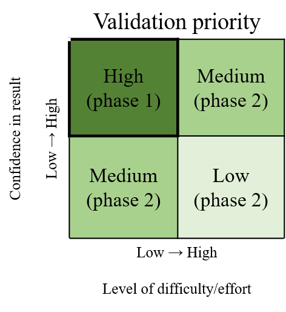

```{r, setup, echo = FALSE}
knitr::opts_chunk$set(
  collapse = TRUE,
  warning = FALSE,
  message = FALSE,
  echo = FALSE,
  comment = "#>",
  fig.path = "../figures/"
)

devtools::load_all('.', quiet = T)
```

# Background

* CSCI is the foundation of stream bioassessment in CA
     * Robust as an assessment method
     * May not be reliable if standard sampling or procedures are not followed, or external events affect a sample
     * We need an approach to determine if a particular sample cannot be reliably used with the CSI

* The landscape model (LSM) provides a context for CSCI scores
     * What are constraints and how are they determined with the LSM
     * How can priorities be defined with the LSM
     * When would an assessment from LSM be unreliable? 

* We need to validate the information for high priority sites
     * Does the constraint class defined by the landscape model reflect the actual landscape context for these sites?
     * Is the biological sample used to calculate the CSCI reliable and within the standard protocol for estimating a site score?
     * What data can we use and what questions can we ask to assess the validity of a bioassessment sample and stream class?

* Who this document is for
     * Resource managers in SGRRMP
     * Resource managers elsewhere that might use CSCI/LSM to prioritize and have similar needs when interpreting bioassessment data
     * Assumes familiarity with CSCI and LSM, including interpretation of standard output

* What this document provides
     * Checklist of questions to evaluate for considering validity of CSCI and LSM scores
     * Organized in hierarchy from low to high effort, i.e., desktop exercise to collection/eval of external data, including additional site visits
     * A decision-support tool to help gather evidence for judgement calls by managers
     
* What this document is not
     * Not a validation of the CSCI as an index - it is a validation of the sample
     * Not a validation of LSM as a model - it is a validation of the data used to define the class
     * No policy recommendations for considering a sample/score valid, this is part of normal QA/QC
     * Does not define what action is pursued once CSCI/LSM are validated

# Validation

## Workflow description

* What is validation? 
    * General process of confirming validity of CSCI score and LSM category for guiding management decisions
    * Validation is within a larger framework that begins with comparing CSCI scores to LSM classification and ends with a decision on how to proceed (e.g., rapid screening for causal assessment, accept as is, collect more data)

```{r, fig.cap="A simplified framework for validating CSCI and SCAPE information.", fig.height=3}
knitr::include_graphics('../figures/simp_temp.png')
```

* The workflow
    * Grey boxes: validation process
    * Green boxes: datasets
    * Pink boxes: decision nodes
    * Yellow boxes: validation outcomes

* Validation process
    * Evaluate both CSCI and LSM assessments
    * The assessment can be invalidated at any step, which may prompt collection of appropriate data
    * Validation priorities - consider the diffulty answering the question and the importance of the question (i.e., how badly does the information need to be verified to consider a score valid. 
    * Desktop validation - uses readily available data from CSCI output or SCAPE website, these are low effort questions
    * External validation - requires evaluation of external datasets, including supporting GIS data, field information, etc., these are high effort questions

```{r, fig.cap="A simplified framework for validating CSCI and SCAPE information.", fig.height=1}

```

<!-- The following is a list of several questions to consider when validating a CSCI score.  Each question focuses on a specific issue that may influence a CSCI outside of the standard operating procedure for the index.  For each question, a description of the issue is provided, how might the issue affect the score, and what data are needed to answer the question.  The questions are also described as simple desktop evaluations (e.g., examination of the metadata that are included with standard CSCI output) or more challenging questions may require additional data (e.g., site visits) or analyses to fully evaluate. A CSCI score could be invalidated for one to any of the questions and it is up to the individual to determine when to stop considering additional questions.        -->

* Types of recommended and required data
    * CSCI QAQC info
    * LSM QAQC info, SCAPE eval
    * Supporting data (external GIS, field data, etc.)
    
* Decisions determine if you continue validation or reach a validation outcome

* Validations outcomes: What decisions do you make once CSCI/LSM are/aren't validated? 
    * The CSCI score is as expected or the site is otherwise low priority - continue baseline maintenance and monitoring
    * Validated 
         * Conduct RSCA
         * Other alternative action
    * Not validated for CSCI or LSM
         * trust results anyway
         * get more samples
         * visit site
         
## Data sources

List of resources to assist with building the validation tool set - can go here or in appendix.

### Metadata 

* CSCI metadata (consult CSCI SOP and package documentation)
* SCAPE website
* Reference site information

### Supporting data

* GIS data
  * StreamCat
  * NHD hydrography
  * Catchment/Watershed layers
  * LU/LC data - NLCD 2006, 2011, NAIP aerial imagery
  * GIS metrics for CSCI
  * Google imagery + time slider
* Field data
  * SWAMP, SMC, CEDEN 
* Local knowledge
  * Field notes
  * Site photos
* Additional external datasets
  * weather conditions (noaa.gov/weather)
  * Fire perimeters
  * Dredging (?)
  * Mining (?)
  * Timer harvest/silviculture (?)
    
## CSCI

### Phase 1 questions 

The validity of a CSCI score may be evaluated by reviewing the metadata that accompanies CSCI reporting, as well as reviewing notes about sampling conditions.

1) Is the sample count sufficient? 
  
Low sample counts may not provide a complete picture of the community that was present during sampling.  The index output that is generated by the CSCI calculator provides information that can be used to evaluate the sample count.  Specifically the "core" output contains a column for each CSCI sample for the sample count:
   
```{r fig.cap = "CSCI metadata that can be evaluated from the standard results.  The first sample returns an invalid CSCI score because of a low sample count (in red)."}
knitr::include_graphics('../figures/coreex1.png')
```

In the first row, we see that the first sample was based on only 100 organisms.  There are no strict guidelines from the SWAMP progrma for how many samples are required, although 100 is wholly insufficient.  Therefore, we can assume that CSCI scores from the first sample are invalid.  

2) Are there many ambiguous individuals or taxa? 

Ambiguous taxa or individuals cannot be used for O/E calculations in the CSCI, and may distort calculations of some metrics. This might occur if, for example, a sample isn’t identified to the CSCI’s standard level of effort (SAFIT1a), or if the sample is dominated by immature or hard-to-identify taxa (e.g., early instar stoneflies) . In these cases, a lower sample count of unambiguous individuals is used to calculate CSCI scores, which may not reflect true site condition.

The taxonomic identifications for macroinvertebrate samples used to calculate the CSCI are compared against SAFIT's standard taxonomic effort (available at [https://safit.org/ste.html](https://safit.org/ste.html)).  The CSCI output returns information on the percentage of observations in a sample that do not conform to the SAFIT taxonomy, both as the percentage of **individuals** from the total count that are ambiguous and the percentage of **taxa** that are ambiguous.  Although no maximum number has been established by the SWAMP program, samples with high percentages may have invalid CSCI scores. 

```{r fig.cap = "CSCI metadata that can be evaluated from the standard results.  The second sample returns an invalid CSCI score because of many ambiguous indivdiuals and taxa (in red)."}
knitr::include_graphics('../figures/coreex2.png')
```

3) Was the sample affected by unusual sampling conditions? 

CSCI scores may be invalid if the sample was affected by natural or temporary disurbances, such as drought, scour from high flow events, or wildfire. The SWAMP sampling protocol indicates that sampling should occur during normal, baseflow conditions.  Sampling outside of these conditions, even during the normal index period from May to September, may result in depressed CSCI scores.  Field notes may indicate if abnormal conditions were present.  Exernal datasets, such as flow records or time and location of fire events, may also provide clues of abnormal conditions.  

### Phase 2 questions    

1) Was the sample outside of the typical index period?

The SOP guidelines for field sampling of macroinvertebraes [@Ode16] states the typical index period from May through September to characterize base flow conditions.  This period depends on the region, such that sampling can occur towards the earlier end of this range in soutern California, and later in this range for higher latitudes.  Sampling that occurs outside of this range will likely not produce a representative sample for which the CSCI can be used.  Sample dates can be verified from the raw data used to calculate the CSCI.  

2) Are there Unusual settings where CSCI is known to give low scores?

3) Bad watershed delineation?

Data to evaluate

* Weather data
* Fire perimeters
* QA reports, CSCI metadata
* Field notes
* Upstream/downstream samples or nearby 
* ASCI, PHAB, CRAM, water quality observations
* Pictures
* Reference sites
* GIS data
* watershed data
* Degree of deviation from expectation

## SCAPE

### Phase 1 questions

1) Sampling reach is atypical of segment’s overall conditions (e.g., unconstrained surrounded by constrained)?

### Phase 2 questions

1) Land cover has changed?
2) Constraints not captured by model (e.g., fire impacts, dredging, mining)?
3) Channel has migrated from nominal location (NHD issues)?
4) Close to landscape model breakpoints?

Data to evaluate

* Satellite imagery
* Site photos
* Alternative land use/land cover data (2006, 2011 NLCD)
* PHAB data (metrics and field notes)
* CRAM
* Landscape stressors not characterized by StreamCat 
* Google images
* Site location relative to NHD segment
* Catchment size
* When is lu/lc change important?
* Reference GIS data

# High priority sites in SGR watershed

* 405CE0280, SMC00480, SMC00144, SMC02972, SMC04524, SMC06496
* Why are these high priority?
* Validate CSCI/LSM results for each using available data to demonstrate the process
* What conclusions are made?  

# Colophon

The current Git commit details are:

```{r}
# what commit is this file at? 
git2r::repository(here::here())
```
