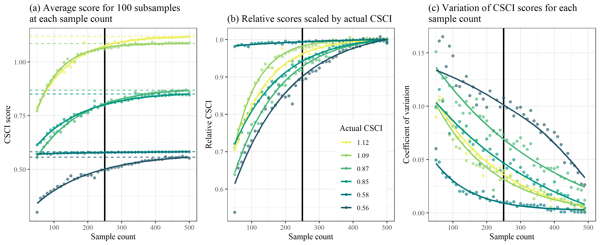

```{r, setup, echo = FALSE, message = FALSE, warning = FALSE}
knitr::opts_chunk$set(
  collapse = TRUE,
  warning = FALSE,
  message = FALSE,
  echo = FALSE,
  comment = "#>",
  fig.path = "../figures/", 
  dev.args = list(family = 'serif')
)

library(here)
library(tidyverse)
library(patchwork)
library(equatiomatic)
library(quantreg)

# # extract bib entries from online
# Jabbrev::bib_scrp(
#   here('analysis/paper', 'decision_framework_SOP.Rmd'),
#   here('analysis/paper', 'refs.bib'),
#   ext_bib = 'https://raw.githubusercontent.com/fawda123/refs/master/refs.bib'
# )

# # check spelling
# spelling::spell_check_files(here('analysis/paper', 'decision_framework_SOP.Rmd'))

load(file = here('analysis/data', 'typscrs.RData'))
load(file = here('analysis/data', 'csciipicram.RData'))

devtools::load_all('.', quiet = T)
```

# Background

The California Stream Condition Index or CSCI is a tool for evaluating the biological integrity of wadeable streams in California using aquatic insect as indicators of stream health and is applicable to most of the diverse conditions found in the state [@Mazor16].  The CSCI is used in routine assessments conducted by the San Gabriel River (SGR) Regional Monitoring Program, a cooperative non-governmental organization that manages aquatic resources in the watershed.  CSCI data collected by the SGR Regional Monitoring Program are the most comprehensive sources of information on biological condition of streams in the region.  Established field sampling protocols are in place to ensure that the data are sufficient to provide an accurate representation of biological communities to evaluate with the CSCI. 

Although the CSCI provides information about the condition of a stream, managers may also want to know what conditions are expected in a stream, given its landscape context. For example, urbanized watersheds may be expected to support low CSCI scores, whereas an undeveloped watershed may support higher scores. Sites that score higher or lower than expected are often a priority for follow-up management actions, such as enhanced investigations, or causal assessment that could lead to restoration. A landscape model that predicts ranges of likely CSCI scores has been developed and applied to most streams in California, including the SGR watershed. 

The landscape model was developed to predict an expected range of CSCI scores relative to the level of landscape alteration that occurs in a watershed [@Beck19b].  Local managers are already using the landscape model with CSCI scores to prioritize sites for different management actions. For example, sites where observed scores are outside the predicted ranges from the landscape model could receive a high priority for follow-up actions, such as additional monitoring, casual assessment, or restoration. However, before actions are pursued at high priority sites, a certain level of confidence is needed in the sample used to estimate the CSCI, as well as in the classification derived from the landscape model.  Samples may not be reliable if standard sampling procedures are not followed or abnormal environmental events affect a sample, producing a CSCI score that does not represent baseline conditions. Similarly, landscape model results may not be reliable if the spatial data used to create the classification do not correctly represent conditions at a site.  A *validation process* is needed at high priority sites to verify the following:

* Is the biological sample used to calculate the CSCI reliable and within the standard protocol for estimating a site score?
* Does the constraint class defined by the landscape model reflect the actual landscape context for these sites?
* What data can we use and what questions can we ask to assess the validity of a bioassessment sample and stream class?

This document provides a set of questions to consider when evaluating the validity of the CSCI or landscape model results at high priority sites. The validation process is organized hierarchically from low to high effort, starting with the simplest questions that are easy to answer and should be evaluated with any assessment.  High effort questions are those that may require additional data that may be more difficult to acquire, or the certainty of the conclusions may require some level of professional judgment.  

Most importantly, this document is not a validation of the CSCI as an index or the SCAPE model; rather it is a validation of the usefulness of the sample used to estimate the CSCI score, or the SCAPE model outputs at the site in question. There are no policy recommendations herein for what makes a sample and/or score valid; validation should be part of normal QA/QC.  Lastly, the document does not provide specific recommendations on what management actions are pursued after validation occurs.  As such, this document is intended as a guide for the analyst or management professional to inform additional scrutiny of high priority locations, where follow-up actions may be chosen based on validity of the CSCI sample and outputs from the landscape model. It is not an appropriate document for field crews to determine how sampling should be done - SOP guidance documents already exist for this purpose (i.e., @Ode16b).

# Validation

## Workflow description

In this document, "validation" refers to one of two process:

* Determining if a CSCI score from a sample is likely to correctly represent the conditions at a site at the time of sampling.

* Determining if outputs from the landscape model are likely to correctly represent conditions at the site under present-day conditions.

This document describes a few activities that do not fall under the validation processes described above, but may still be good standard practices to follow when making decisions from CSCI data or the landscape model. For example, the document describes a process to determine if wildfire may have influenced CSCI scores; evidence of the influence of wildfire does not invalidate a bioassessment, yet it should be evaluated when considering the likely causes of low CSCI scores.

Validation is the process of confirming validity of a CSCI score and stream channel classification from the landscape model.  A "valid" CSCI score or classification is determined from professional judgment after reviewing appropriate data as being a sufficient description of the biological condition or constraint class, respectively, within the limits of the methods used to estimate each component. Validation is also within the larger framework of comparing CSCI scores to results form the landscape model to develop priorities, such that high priority sites identified through this process should undergo validation prior to follow-up actions.  The validation process ends with a determination on whether or not the CSCI score and/or landscape model classification are sufficiently accurate to warrant follow-up management actions. 

```{r valflo, fig.cap="A framework for validating CSCI and landscape model (LSM) information.", fig.height=3}
knitr::include_graphics('../figures/simp_temp.png')
```

The conceptual framework for the validation process is shown in Figure \@ref(fig:valflo).  High priority sites are first identified by comparing CSCI scores to expectations from the landscape model. Validation can occur if a site is considered high priority, which may be a site that has a CSCI score that is not within the expected range.  If the site is otherwise low priority, then baseline monitoring and maintenance should be continued.  For high priority sites, the validation process is shown in the light grey box.  

Separate but parallel validation processes occur for the CSCI score and landscape model classification. In both validation processes, questions vary in the level of difficulty to answer regarding validity of the CSCI sample or SCAPE output.  Difficulty can very either because the data to address the question may or may not be readily available or the certainty of the conclusion can vary because of incomplete knowledge about how much the issue affects the outcome. Questions are generally organized in the section below from simple/easy to answer vs more difficult questions that may require some level of professional judgement. 

A CSCI score or landscape model classification can be invalidated at any step in the validation process.  A final conclusion is that one or both of the results are invalidated and that more data may be needed, which can include a site visit to collect information or to verify existing data.  Once new data are obtained or existing data are confirmed, the validation process is reinitiated.  The process occurs iteratively until both the CSCI score and landscape model result are sufficiently validated, i.e., the analyst has confidence the results of both are sufficient for pursuing follow-up actions. If both are validated, the validation process is finished and additional actions can be pursued, which may include rapid causal analysis to determine why biological condition differs from the expectation. If it is not possible to validate the information with additional data, the analyst can also decide to proceed with follow-up actions regardless of the results.  In other words, the analyst may decide to trust the results based on their professional judgment, regardless of what the validation process provided.  

It is also important to note that the CSCI is sensitive to stressors that may be caused by unusual events and that the score is valid in these instances, although it is not representative of "normal" conditions.  Whether or not a CSCI score is valid after a temporary disturbance depends on the purpose of the sampling.  If the sampling is meant to capture the effects of these events, then the score is more than likely valid.  However, if the objective is to evaluate "normal", long-term conditions at a site, then the score may not represent these baseline conditions.  In the latter case, field crews may or may not be aware of temporary events that can depress CSCI scores.  If there is reason to question a score based on an unusual sampling condition, external data must be consulted. Field notes may be the best source of information.    

## CSCI validation

The following is a list of questions to consider when validating a CSCI score.  Each question focuses on a specific issue that may influence a CSCI score outside of the standard operating procedure for the index.  These questions correspond to the left track of the validation box in Figure \@ref(fig:valflo). For each question, a description is provided for why the the question or issue is a problem, followed by a description of what data do you need or where to you look to determine if the problem applies to your sample.  A CSCI score could be invalidated for one to any of the questions and it is up to the analyst to determine when to stop considering additional questions.

Some of the more common reasons for why a sample does not produce a valid CSCI score are as follows. Keep these common scenarios in mind when reviewing the validation questions below. 

* Standard sampling methods were not used.
* Sampling was conducted well outside of the normal index period.
* Sampling occurred in brackish or tidally-influenced waters.  This is more a concern outside of southern California.

For all validation questions, data from upstream or downstream stations could be consulted, if available, to compare to the current station.  Ideally, these stations should reflect conditions for the same or similar upstream catchment as the test site, i.e., do not compare stations on different tributaries, whereas stations along a mainstem could be reasonable compared. Distances between stations to compare should also be considered.  Stations farther apart may show larger natural differences in CSCI scores higher in the watershed than those lower in the watershed.  

In all cases, large differences in CSCI scores at a test site compared to those at nearby sites could provide some clues regarding validity of the sample, e.g., inadequate sampling was conducted at the test site but not those nearby.  Conversely, similarity of a CSCI score at a test site with those nearby could suggest that processes occuring at larger spatial scales are affecting the sample, as for high volume rain events that scour the stream channel at several locations.  Regardless of the differences, sites nearby can provide clues regarding validity of the sample.   

### Number of organisms in a sample (i.e., sample count)

*Why is this a problem?* 

The CSCI was calibrated with samples containing exactly 600 organisms. Smaller counts may yield inaccurate (and likely lower) CSCI scores because smaller samples may not provide a complete picture of the community that was present during sampling. Sample counts could be low for several reasons, including but not limited to sampling failure (e.g., loss of insects from net failure), poor timing of sampling (e.g., outside of index period), or sampling protocols from the field manuals were not followed. 

*Where do you find an answer?*

The report that is generated by the CSCI calculator (<https://sccwrp.github.io/CSCI>) includes a "Count" column which indicates the number of organisms present in the original sample (Figure \@ref(fig:coreex)).
   
```{r coreex, fig.cap = 'The CSCI core report includes metadata that can be used to evaluate the validity of a sample.  The total number of organisms is indicated in the "Count" column, highlighted in red.'}
knitr::include_graphics('../figures/coreex1.png')
```

*How do you evaluate the answer?* 

We recommend a minimum of __250__ organisms in a sample for CSCI scores to be considered valid (Figure \@ref(fig:sumeffind)).

```{r sumeffind, fig.cap = "Effects of systemetically reducing sample count on CSCI scores for six sites.  The dashed lines indicates the true CSCI score at each site and the vertical black line indicates a minimum sample size of 250."}
knitr::include_graphics('../figures/summary_results_effort_ind.png')
```

This recommendation is based on simulation analyses presented in the appendix, where sample counts were reduced at random, and scores were compared to the original (true) score based on the full 600-count sample. As long as counts were above 250, the estimated score was typically within 10% of the true score, with relatively little variation across simulations. In general, low count samples had biased, low-scoring CSCI scores (although biased high-scoring samples were also observed in some iterations). Sites with low richness and high evenness were more robust to small counts than were more diverse samples. Additionally, low-scoring samples tend to be more robust than high-scoring samples.

If a sample count is low, it is best to collect or seek out additional samples from the site. If higher-count samples are available, the lower-count sample should be disregarded, as it likely reflects transient conditions or sampling error. That is, the low number of organisms __invalidates__ the CSCI score in these circumstances.  However, if repeated sampling consistently yields low-count samples, this pattern may indicate severe, long-term disturbance (e.g., repeated drying and scouring of flood-control channels) or natural conditions (e.g., certain bedrock-dominated streams) that are intrinsically depauperate in benthic macroinvertebrates. Further investigation of the site will determine whether the consistently low counts are due to natural or anthropogenic factors. If the low counts are unambiguously attributable to natural circumstances, the low count invalidates the CSCI score; otherwise, the CSCI scores are likely __valid__.

### Proportion of ambiguous individuals or taxa in a sample 

*Why is this a problem?* 

Ambiguous individuals or taxa cannot be used to calculate the O/E component of the CSCI, and may distort calculations of some metrics in the MMI component, likely leading to an underestimate of the CSCI score. Ambiguous taxa may be found in low numbers in any bioassessment sample, but they can create a problem when they comprise a large portion of the organisms in a sample. High proportions of ambiguous taxa may occur if a sample isn’t identified to the CSCI’s standard level of taxonomic effort (SAFIT1a), or if the sample is dominated by immature or hard-to-identify taxa (e.g., early instar stoneflies).

Ambiguous taxa are excluded from calculating many components of the CSCI, leading to inaccurate scores for the same reasons as described above (under "Number of organisms in a sample""). Additionally, ambiguous taxa often lack trait information used to calculate certain metrics (e.g., tolerance value, functional feeding group). If all the ambiguous taxa belong to a certain group (e.g., stoneflies), excluding them from metric calculation will mischaracterize the composition of the sample. Therefore, the presence of a high proportion of ambiguous taxa should be considered a separate problem from low counts in a sample.

*Where do you find an answer?*

The taxonomic identifications for macroinvertebrate samples used to calculate the CSCI are compared against SAFIT's standard taxonomic effort (available at [https://safit.org/ste.html](https://safit.org/ste.html)).  The CSCI output returns information on the percentage of a sample that does not conform to the SAFIT taxonomy, both as the percentage of individuals from the total count that are ambiguous and the percentage of taxa that are ambiguous.  Although no maximum number has been established by SWAMP, samples with high percentages of ambiguous taxa may have invalid CSCI scores. Figure \@ref(fig:coreex2) shows output from the CSCI calculate that reports the percentage of ambiguous individuals and taxa.  The second sample for site 3 has many ambiguous observations.

```{r coreex2, fig.cap = "CSCI metadata that can be evaluated from the standard results.  The second sample returns an invalid CSCI score because of many ambiguous individuals and taxa (in red)."}
knitr::include_graphics('../figures/coreex2.png')
```

There are several possible causes for a high proportion of ambiguous taxa in a sample:

* Samples were collected very early, well before the normal index period (which for southern California is May 15 to July 15). Samples collected mid-winter (e.g., December to February) tend to have many early-instar taxa, which are difficult to identify to the desired levels.

* The sample was poorly preserved, and specimens were in poor condition. Notes from the taxonomy lab should indicate if this was the case. Field crews should be notified so that they can improve sample preservation practices.

* The taxonomy lab did not apply a level of effort (i.e., SAFIT 1a or 2) required for CSCI calculation. Work orders and chains-of-custody should indicate the level of effort the lab strove for.

Regardless of the cause of ambiguous taxa, it is better to evaluate the overall severity of the problem before deciding that a sample should be used for CSCI calculation.

*How do you evaluate the answer?*

We recommend a maximum of __50% ambiguous taxa or individuals__ in a sample for CSCI scores to be considered valid. Higher proportions invalidate a sample (Figure \@ref(fig:sumambind)).

```{r sumambind, fig.cap = "Effects of systemetically increasing the proportion of ambiguous taxa in a sample on CSCI scores for six sites.  The dashed lines indicate the true CSCI score at each site and the vertical black line indicates a recommended maximum of 50% ambiguous taxa."}

```

This recommendation is based on simulation analyses presented in the appendix, where ambiguous identifications were introduced in to sample at random, and scores were compared to the original (true) score based on the original sample. As long as the proportion of ambiguous taxa or individuals were above below 50%, the estimated score was typically within 10% of the true score, with relatively little variation across simulations. 

*What can you do if your sample has a high proportion of ambiguous taxa?*

If ambiguous taxa are largely midges (the typical scenario when the taxonomy lab used SAFIT Level 1 as a standardized taxonomic effort level), rescore the sample using the `MissingMidges()` function in the CSCI package. This function assumes that all undetected midge subfamilies are present, providing a defensible upper-end estimate of CSCI scores. This range can then be used to determine if reanalysis of vouchered specimens may be worthwhile.

If ambiguous taxa are largely non-midges, or if the range of possible CSCI scores identified through the `MissingMidges()` function is too large, additional sample collection may be necessary.

### Abnormal stream flow

*Why is this a problem?* 

Abnormal flow events or high flow conditions can scour stream beds and lower biodiversity as a site. This can produce samples that have lower macroinveretebreate diversity than would be expected for what the site supports under baseline conditions. Although high flow events can occur during and after storms, scouring resulting from human activities (e.g., dam releases) should be interpreted as an impact.  In such cases, the CSCI scores are expected to reflect the impact of an anthropogenic stressor and the sample should be considered __valid__.  For baseline assessment, scour from natural events and the effect on the sample are the primary concern for validation.

The influence of abnormal flow __does not invalidate__ a CSCI score. On the contrary, low scores could indicate that the abnormal flows are having a detrimental impact on stream condition. However, abnormal flows could obscure the impacts of other stressors, like pollution or habitat degradation, and the data may be less useful to answer certain bioassessment questions.

*Where do you find answers and how are they evaluated?*

There are three typical sources of information about scour (in order of decreasing importance for validation):

1. Notes from field crews should indicate if they observed evidence of recent scour (e.g., minimal algae growth, evidence of recently displaced rocks, etc.). Site photos collected by field crews may provide further evidence.
     * Notes from well trained, experienced, and regularly audited/intercalibrated field crews should be considered evidence that scour may have influenced a bioassessment sample.

2. Continuous flow data from a stream gauge (e.g., USGS flow stations). In general, gauges should be close to the sampling location (ideally, the areas of the watershed contributing to the gauge and the watershed contributing to the sampling location should vary by no more than 10%). These data can be used to produce hydrographs, indicating the timing of peak flows, relative to the timing of sample collection. For sites downstream of dams (within 5 km), data on dam releases may provide similar evidence. 
     * Hydrographs that indicate the sudden onset of flow within 2 weeks of the sampling date should be considered evidence that scour may have influenced a bioassessment sample.

Below is an example of retrieving stream gauge data using the USGS [`dataRetrieval`](http://usgs-r.github.io/dataRetrieval/index.html) package for R [@DeCicco18]: 

```{r, echo = T, message = F, warning = F, fig.cap = 'Flow record for four years at the San Gabriel mainstem.  Note the storm peaks in the winter rainy season that could be consided abnormal flow.', fig.height = 4, fig.width = 8}
library(dataRetrieval)

siteNumber <- "11087020" # San Gabriel mainstem
parameterCd <- "00060"  # Discharge
startDate <- "2015-10-01"  
endDate <- "2019-09-30" 

discharge <- readNWISdv(siteNumber, parameterCd, startDate, endDate)

plot(X_00060_00003 ~ Date, type = 'l', data = discharge, ylab = 'Discharge (ft3/s)')
```

3. Rainfall data (e.g., from NOAA stations) may also provide evidence of scour. However, a small amount of rainfall can lead to extensive scour at some sites, while large storms may have minimal impact on others. Data from nearby gauges (within 10 km in low elevations, or 5 km in mountainous regions) can be used to identify the timing and magnitude of storms, which can then be used to infer if scouring might have occurred.
     * Evidence of major storms occurring within 2 weeks of the sampling date should be considered evidence that scour may have influenced a bioassessment sample. As a general rule for the San Gabriel watershed, a major storm is one with more than __1 inch__ of precipitation in 24 hours. However, best professional judgment and local expertise may support different criteria for identifying major storms in some settings.

*What can you do about it?*

Additional samples may need to be collected if a sample was affected by abnormal flow conditions.

### Drought conditions

*Why is this a problem?* 

Drought conditions (and the management response to droughts, such as diversions or groundwater extraction) can stress stream communities in several ways, primarily by reducing flow below baseline.  Flow reduction can alter the physical and chemical conditions in the stream, which can adversely impact biological communities.  Changes from reduced flow may include reduced dissolve oxygen, increased stream temperatures, encroachment of riparian vegetation, concentration of pollutants, and saltwater intrusion in coastal streams. Natural streams have some resilience to drought, particularly those in semi-arid climates such as southern California.  

The influence of drought does not invalidate a CSCI score. As described above, drought may exacerbate the impacts of anthropogenic stressors. However, determining whether drought has influenced a CSCI score can be useful for assessing overall stream condition.

*Where do you find an answer?*

Normal protocols defined under the stream sampling SOP [@Ode16b] require that sampling be conducted under baseline conditions.  Field notes should be consulted to determine if flow was abnormally low, possibly as a result of drought or diversions. For example, sampling transects may have been skipped if stream flow was discontinuous on the sampling reach.  The field notes should indicate if any deviation occurred from the normal protocol. Sites where the normal sampling protocol was altered do not produce accurate CSCI scores. 

External data sources can also be consulted. A [weekly drought map](https://www.climate.gov/maps-data/dataset/weekly-drought-map) may provide information on conditions at the time of sampling.  Climate and drought indices can also be estimated using [open source software](https://www.drought.gov/drought/climate-and-drought-indices-python).  The Palmer Drought Severity Index ([PDSI](http://www.droughtmanagement.info/palmer-drought-severity-index-pdsi/)) may be a good point of reference.

*How do you evaluate the answer?*

Drought conditions should be evaluated relative to the magnitude (how dry) and duration (how long).  Drought conditions that are more severe and that persist for longer will have a larger effect on stream health.

*What can you do about it?*

Additional samples may need to be collected if a sample was affected by drought conditions.

### Fire

*Why is this a problem?* 

Fire events that occur in the watershed or riparian area can dramatically affect CSCI scores. Fire can alter soil chemistry and water runoff characteristics, which in turn affects stream conditions.  Sites impacted by fire typically have increases in fine sediment and chemical changes from burned debris or litter that flows downstream.  Riparian conditions may also change if vegetation in or around the stream is removed by fire, which can increase stream temperature.  As a result, biological integrity is reduced post-fire and may not recover until several years after the fire.  An evaluation of fire impacted sites in the Lake Tahoe basin showed that communities did not recover until two years after a fire event [@Oliver12].  In southern California, bioassessment scores at reference sites did not recover until one to two years post-fire, with burned sites having reduced taxonomic diversity and characterized by rapid colonizers and pollution-tolerant taxa (e.g., black flies and minnow mayflies) [@Rehn11]. 

Although fire is a natural phenomenon, an increase in the severity and magnitude may result from climate change or may otherwise be exacerbated by drought conditions.  Moreover, evidence of the influence of wildfire does not invalidate a CSCI score, but may provide useful information for understanding why scores may be low.

*Where do you find an answer?*

As always, field notes should indicate if conditions at the time of sampling are affected by fire.  Additionally, geospatial data can be consulted to view fire perimeter maps ([Cal Fire Hub](https://hub.arcgis.com/datasets/653647b20bc74480b335e31d6d81a52f)) that may have occurred in the watershed for a sampling site.  Overlaying the fire perimeter over the watershed boundary can provide an indication of what percentage of the watershed was burned.  There are no clear boundaries for how much of the watershed is burned to determine if the stream sampling site is adversely affected. However, impacts are more likely to be observed if a larger percentage of the watershed was burned and the fire perimeter is closer to the sampling site (e.g., as opposed to higher up in the watershed). 

*How do you evaluate the answer?*

Although fire impacts can vary from site to site, these guidelines can provide a general indication if a site is likely to be impacted:

* The site was directly burned within the past 5 years.

* More than 10% of the watershed within 5 km of the sampling location was burned within the past 5 years.

* More than 25% of the watershed (any distance upstream of the sampling location) was burned within the past 5 years.

*What can you do about it?*

Previous studies in southern California show that many burned reference sites have scores that return to pre-burned values in 1-2 years [@Rehn11].  Sites surveyed in the SGR watershed were observed to return to baseline conditions 2.5 to 3 years post-fire. Therefore, we recommend resampling no sooner than three years post burn to characterize baseline stream condition.

### Vegetation management, debris removal

*Why is this a problem?* 

Vegetation management, debris removal, and stream regrading can be common management activities in urban streams. These activities help remove in-stream barriers that may obstruct normal flow operations or otherwise assist in maintaining flood control.  However, these activities can have acute, short-term impacts on benthic communities, either through direct habitat removal (as for vegetation removal) or promotion of downstream drift (as for regrading). Herbicides that could be used for vegetation removal may also be non-specific and can harm other stream biota.  Although low CSCI scores correctly reflect these impacts, we may want to identify samples that are particularly affected by them, as opposed to samples that reflect baseline conditions. Evidence of these activities does not invalidate a CSCI score.

*Where do you find an answer?*

Flood control maintenance records provided by public works departments or sanitation districts can provide information on the location and types of maintenance activities that could have occurred at a sampling site.  Field notes may also indicate conditions that suggest recent maintenance operations have occurred, such as a stream bed that has been recently regraded or habitat conditions that otherwise differ from those that were observed at the previous visit (e.g., vegetation present previous year but absent in the current). 

*How do you evaluate the answer?*

If vegetation or debris removal occurred within 2 weeks of the sampling event, the CSCI score is likely to be influenced by this activity.

*What can you do about it?*

Additional samples may need to be collected at a later date after which biological communities are not affected by the vegetation removal. 

### Vector control activities

*Why is this a problem?*

Vector control activities are also common in urban streams to control nuisance species that may impact public well-being and health.  Pesticides may be applied in some cases, whereas biological controls could be used in others (BTI applications or mosquitofish introductions).  In more extreme cases, waterbodies may be diverted or drained to eliminate a water source that acts as a biological vector. In all cases, vector control activities can negatively affect the natural macroinvertebrate community as controls are usually non-specific, causing lower CSCI scores. Evidence of these activities does not invalidate a CSCI score.

*Where do you find an answer?*

Records in existing databases, such as the SMC database, can indicate if biological control vectors are present.  For example, fish surveys or field notes could indicate if mosquitofish are present at a site.  Chemistry data may also indicate if pesticides are present.  If none of the above provide clues, municipal agencies that conduct vector control operations could be contacted.

*How do you evaluate the answer?*

Any evidence of pesticide application or biological control of disease vectors that has occurred within the same year as sampling collection is likely to influence a CSCI score.

*What can you do about it?*

If possible, collect additional samples prior to the implementation of vector control activities.

### Sample collected outside of the typical index period

*Why is this a problem?* 

The SOP guidelines for field sampling of macroinvertebrates [@Ode16b] states the typical index period as being from __May__ through __September__ to characterize base flow conditions.  This period depends on the region, such that sampling can occur towards the earlier end of this range in southern California (typically May 15 to July 15), and later in this range for higher latitudes.  Sampling that occurs outside of this range could produce a sample that is not representative of the macroinvertebrate community for which the CSCI is calculated. 

Sampling outside the index period may invalidate a CSCI score if it results in high numbers of ambiguous taxa, as described above.

*Where do you find an answer?*

The date of sampling should coincide with the guidelines outlined above.  However, in southern California, these recommended sampling dates are contracted due to more pronounced seasonal flow cycles in this more arid climate. If sampling is well past July or well before April, the likelihood increases of not sampling the community under baseline conditions. Also, see the guidelines above on scour and drought as this often relates directly to the sample period.

*How do you evaluate the answer?*

Several studies have shown that the CSCI is generally robust to samples collected outside of the index period, as long as flow conditions are adequate for sampling, and specimens are mature enough to support unambiguous identifications. Refer to criteria about flow and ambiguous taxa for evaluating samples collected outside the normal index period.

*What can you do about it?*

Collect additional samples during the recommended sampling period.

### Watershed delineation

*Why is this a problem?* 

The CSCI requires data describing landscape characteristics of the watershed for a site.  These data are used to develop a prediction of the macroinvertebrate community that could be expected at the site under reference conditions.  A watershed delineation is required for a site to obtain these landscape data for the CSCI predictions. The CSCI interim instructions [@Mazor18b] describe in detail how these delineations can be created.  In short, a digital elevation model is used with the site's longitude/latitude to identify the area of land where all elevations are increasing and higher than the starting elevation of the site.  This watershed is then used to calculate landscape-level data needed for the CSCI, such as the total elevation range, average precipitation, and various soil characteristics.  An inaccurate representation of the watershed can produce inaccurate estimates of the landscape data used to calculate the CSCI.

The watershed delineation process is partially automated using standard geospatial software, with some intervention and manual inputs from the analyst.  In general, delineations will accurately represent the watershed at the site if: 

* The actual site location is spatially co-located with a stream reach line in a GIS, and vice versa.
* The actual drainage area is well-represented by topography. 

For the first scenario, the site location is typically referenced by longitude/latitude coordinates.  For delineation, these coordinates must be spatially linked to a stream reach in a GIS. Stream reaches are usually represented by the NHD-Plus dataset [@McKay12], which is a national-level product describing stream hydrography for the entire United States. The first step in the delineation is to "snap" the site location to the nearest stream reach.  If the site location is imprecise or was entered incorrectly, the snapping distance can be large.  Conversely, the stream reach in the NHD-Plus dataset may not accurately portray the true channel.  In either case, the resulting watershed will originate from a location that does not represent reality.  Visual assessment of the site location, the segment that was used for the delineation, and the snapping distance can provide clues about the quality of the delineation.  

For the second scenario, topographical characteristics of the landscape around a site can also affect the quality of the delineation.  In general, watershed boundaries are more easily identified at high gradient sites in hilly or mountainous areas where topographical variation is more pronounced.  Conversely, low gradient streams may have less accurate watershed delineations because it is more difficult to identify clear elevation differences that define drainage patterns.  The latter scenario is more common in coastal plains, plateaus, or other low-topography areas.  Developed landscapes also complicate watershed delineations because the flow of water may have been significantly altered from natural patterns.  In these cases, water may not follow strict topographical boundaries due to channelization or diversions. Overlaying the watershed delineation on aerial photos can provide clues about the effect of land use alteration on flow patterns and if the delineation is well-represented by topography.   

*Where do you find an answer?*

Obtain the original watershed polygon that was delineated for the site.  This file is usually in the SMC database and can be located by contacting SCCWRP staff.  Once the file is obtained, use GIS software to overlay the polygon on a base layer that shows stream hydrolines and the surrounding landscape.  Visual inspection of the polygon with the landscape will provide some clues about the quality of the delineation. 

*How do you evaluate the answer?*

Figure \@ref(fig:delinex2) provides some examples of how snapping and quality of the delineation can produce inaccurate watershed polygons.  In all four plots, the pink dot represents the latitude/longitude of the recorded site location and the green dot represents the location where the site was snapped to the stream hydroline for the delineation.  In Figure \@ref(fig:delinex2)a, we see a snap that produced a likely realistic representation of the watershed that drained to the site.  However, in Figure \@ref(fig:delinex2)b, we see a problematic snap where the location was shifted upstream to a tributary.  In this case, the watershed is an under-representation of what drains to the site.  In Figure \@ref(fig:delinex2)c, we see a site that was manually snapped to a location and the watershed was manually delineated. In Figure \@ref(fig:delinex2)d, we see the same site but the snap location is likely incorrect and the resulting watershed is likely inaccurate.  These final two examples represent the challenges of watershed delineation in developed settings, where manual changes may be needed to create a more realistic interpretation of the watershed. 

```{r delinex2, fig.cap = 'Watershed delineation examples showing snapping challenges. The pink dot is the recorded site latitude/longitude and the green dot is the snapped location.  The watershed boundaries resulting in each case are outlined in red.'}
knitr::include_graphics(here('analysis/figures', 'delinex2.png'))
```

*What can you do about it?*

Manual editing of the polyon may be needed if the delineation is inadequate.  Alternativaly, follow the procedures in the CSCI interim instructions [@Mazor18b] to delineate a new watershed.  In both cases, the GIS predictors obtained from the delineation must be estimated again prior to calculating a new CSCI score. 

### Tidal influence at a sample site

*Why is this a problem?*

Streams in close proximity to coastal areas may be tidally-influenced through groundwater or direct exchange through tidal inlets.  Although macroinvertebrates communities can thrive in tidally-influenced streams, the CSCI was not calibrated for these locations.  Many of the taxa expected to occur in wadeable streams cannot withstand the stresses posed by the high and fluctuating salinity levels these waterbodies exhibit, and so even an unstressed stream would likely have a low CSCI score. 

Evidence of tidal influence __invalidates__ a CSCI score, except when the tidal influence is due to human activity (e.g., excessive groundwater pumping leading to saltwater intrusion). 

*Where do you find an answer?*

1. In some coastal watersheds tidal influence is controlled by drop structures or tidal gates (e.g., the drop structures near the 405 freeway limit the extent of tidal influence on the San Gabriel River). Samples collected downstream of these controls should be considered tidally influenced.
1. Site is located within mapped estuarine region (https://map.dfg.ca.gov/metadata/ds2792.html), immediately contiguous with saline waters, and at elevations within twice the spring tide height for the region.
1. Field notes or other local expertise suggesting bi-directional flows from tidal exchange or dominance of halophytic vegetation (e.g., pickleweed, marsh cordgrass, or black needle rush/Juncus spp. as a low salinity indicator)[^*]
1. The sample has a high abundance of marine or brackish invertebrates, such as polychaete worms (such as Manayunkia, Ficopomatus, or Nereis)$^1$
1. Direct measurements of salinity at a sample site can provide an indication of relative tidal influence.  Note that tidal conditions vary daily and with precipitation patterns, so a single measure of salinity may not reflect the gradient of conditions at a site. A complete survey of salinity covering the tidal cycle (e.g., over 12 hours) or, at a minimum, one sample occurring at mean high water, will provide a more complete description of the salinity regime.  

[^*]: These indicators should be interpreted with caution and only indicate tidal influence at sites within a few kilometers of the coast

*How do you evaluate the answer?*

Any indication that the sample site is tidally-influenced is evidence that the sample is not valid for calculating the CSCI, unless as noted above, the tidal-influence is the result of human activity.  Specific conductivity measurements in excess of 10,000 uS/cm$^1$ could be considered tidally-influenced.

*What do you do about it?*

Collect additional samples well upstream where the location is not tidally-influenced. 

### Sample collected from a setting where the CSCI is suspected to give low scores

*Why is this a problem?* 

There are some settings in California where CSCI scores have been hypothesized to be unreliable (e.g., watershed underlain by the Monterey formation or similar recent marine sediments), although there are few studies that have thoroughly explored this issue.  In these settings, scores may be depressed because the biological community may be naturally low in diversity and the reference pools do not account for these localized exceptions.  For example, the geological setting may be uncharacteristic of the region [e.g., unusual geology types with limited extent, @Campbell09].  This setting can influence the physical and chemical characteristics of the stream that structure the diversity of the biological community.  This confounds the ability of the CSCI to distinguish between natural and anthropogenic variation, resulting in unreliable scores. Samples collected from such settings may invalidate a CSCI score, or require adjustments for correct interpretation.

*Where do you find an answer and how do you evaluate the information?*

Evaluating the potential that natural settings introduce bias to the CSCI or other bioassessment indices requires rigorous study, typically following these steps:

1.	Review the literature to determine if factors related to the setting are known to influence the abundance or distribution of benthic macroinvertebrates. The more relevant the study (e.g., in California or on taxa found in California), the better.
1.	Evaluate scores at reference sites in the unusual setting. If scores are high (e.g., mean close to 1, 90% of scores > 0.79), you have confidence that the CSCI is valid in this setting. Look in [CEDEN](http://www.ceden.org/) or the SMC data portal as a preliminary step in finding these sites. Additionally, consult the development data that comes with the [CSCI](https://github.com/SCCWRP/CSCI) package.  Specifically, the `loadRefBugData()` function can be used to view reference taxonomy data or the `loadRefData()` function can be used to view reference site data that were used to build the CSCI. However, keep in mind that if the unusual setting is represented in the CSCI development data set, there is little reason to doubt the applicability of the index in that setting. 
1. If reference sites are unavailable to characterize the unusual setting, the least stressed sites should be identified.  If the CSCI scores are high at these sites (e.g., mean close to 1, 90% of scores > 0.79), there is confidence that the CSCI is valid in this setting.  However, if these scores are lower, the CSCI may or may not be valid at identifying reference conditions in this setting.  Regardless, the scores may still be valid for evaluating relative condition. Consider evaluating if CSCI scores respond negatively to stressor gradients within this setting.  If there is large correlation (e.g., R$^2$ >0.2), the CSCI is likely responding to stress in this setting.

### Incorrect GIS predictors for the CSCI

*Why is this a problem?*

GIS predictors are required for calculating CSCI scores. The CSCI interim intstructions [@Mazor18b] provide information on which GIS metrics are used and how they can be estimated. These predictors include:

* site latitude/longitude
* site elevation
* elevation range
* watershed area
* average precipitation 
* average temperature
* mean June to September monthly precipitation 
* average bulk soil density
* average soil erodibility factor
* average phosphorus geology  

This information is used in the predictive model of the CSCI to help identify an expected macroinvertebrate community based on watershed or other landscape characteristics. If the predictors are inaccurate, then the expected community will no incorrectly predicted and the overall CSCI score will be invalid.  Predictors could be inaccurate because of an inaccurate watershed delineation or the predictors do not describe landscape conditions at the time of sampling. 

*Where do you find an answer?*

The watershed delineation should first be evaluated to determine accuracy, see the section above.  Any inaccuracies in the delineation will produce inaccurate GIS predictors. Second, consult the section below on "has land cover changed recently?" for the landscape model.  This section describes how to validate issues of currency in GIS data. 

*How do you evaluate the answer?*

Verification for some of the GIS predictors reflect reality requires some background knowledge about the watershed, such as soil characteristics and climate patterns.  Other predictors can be quickly verified by manual checks for relative accuracy, such as approximate watershed area or elevation ranges.  For example, a large elevation range in a low-topography setting would be suspect.

*What do yo do about it?*

In most cases, the watershed delineation is the cause of incorrect GIS predictors.  See the previous section regarding bad watershed delineations. 

## Landscape model validation

The landscape model validation questions correspond to the right track of the grey validation box in Figure \@ref(fig:valflo).

### Sampling reach is atypical of a channel's overall class (e.g., unconstrained class surrounded by constrained classes)

*Why is this a problem?*

The landscape model assigns a constraint class to digitized reaches in the NHD-Plus stream hydrography layer.  A reach can be described as one of four classes: likely constrained, possibly constrained, possibly unconstrained, likely unconstrained.  Typically, stream reaches of the same class co-occur in space such that it is more likely that a constrained reach is surrounded by other constrained reaches and an unconstrained reach is surrounded by other unconstrained reaches. Occasionally, a stream segment will have a constraint class that differs or is otherwise unexpected based on the classes for reaches nearby.  For example, an unconstrained reach may be found in an urban setting where reaches upstream and downstream are constrained.  This could reflect a real phenomenon or could be an artifact of the data.  In these cases, the constraint class should be investigated. 

*Where do you find an answer?*

Viewing an aerial image of land use for a site is the easiest way to assess the validity of an unexpected stream class. The online [SCAPE](https://sccwrp.shinyapps.io/scape) application provides this information for the San Gabriel River Watershed.

For locations not in the San Gabriel watershed, a [shapefile](https://knb.ecoinformatics.org/view/urn:uuid:75411f50-32ed-42a5-bbfd-26833c7a441f) is available for all stream reaches in California where the landscape model was applied.  

*How do you evaluate the answer?*

As an example, Figure \@ref(fig:scapex) was taken from SCAPE and shows a stream reach that is assigned a class of likely unconstrained.  All of the surrounding reaches are possibly or likely constrained.  Without looking at the land use, we might assume that this constraint class is invalid (Figure \@ref(fig:scapex)a). We can toggle the base layer to show a satellite image of the location to get a better idea of the landscape (Figure \@ref(fig:scapex)b).  From the satellite image we can see that this reach drains a small undeveloped, hilly area upstream of the housing units.  With this information we can assume that the constraint class is valid because it accurately reflects land use in the watershed.

```{r scapex, fig.cap = "An unexpected stream class is validated by examining the land use, lane cover base layer."}
knitr::include_graphics(here("analysis/figures", "scapex.png"))
```

*What do you do about it?*

Verify that you agree with the classification or assign a classification that is appropriate for the sampling reach. 

### Land cover has recently changed

*Why is this a problem?*

The landscape model provides an expectation of biological condition based on the landscape characteristics of the watershed upstream of a site.  The landscape characteristics are based on national-level, geospatial data products that characterize the relative extent human development in the watershed.  Specifically, the landscape model is based on StreamCat data [@Hill16] that provide estimates of canal/ditch density, imperviousness, road density/crossings, and urban/agricultural land use for each site.  Within StreamCat, many of these estimates were derived from primary data products, such as the National Land Cover Database for 2006 and 2011 (Table \@ref(tab:crvr)).  Because some of the primary products relate to a specific year, the associated constraint classes from the landscape model may not accurately reflect current constraints.  

```{r crvr, tidy = F}
# streamcat variables used in core models
nms <- c("CanalDens", "PctImp2006", "TotUrb2011", "TotAg2011", "RdDens", "RdCrs")
scl <- c('Cat, Ws', 
         'Cat, Ws, Cat + Rp100, Ws + Rp100',
         'Cat, Ws, Cat + Rp100, Ws + Rp100',
         'Cat, Ws, Cat + Rp100, Ws + Rp100',
         'Cat, Ws, Cat + Rp100, Ws + Rp100',
         'Cat, Ws'
)
         
dsc <- c(
  'Density of NHDPlus line features classified as canal, ditch, or pipeline',
  'Mean imperviousness of anthropogenic surfaces (NLCD 2006)',
  'Total urban land use as sum of developed open, low, medium, and high intensity (NLCD 2011)',
  'Total agricultural land use as sum of hay and crops (NLCD 2011)',
  'Density of roads (2010 Census Tiger Lines)',
  'Density of roads-stream intersections (2010 Census Tiger Lines-NHD stream lines)'
)
unt <- c('km/sq km', '%', '%', '%', 'km/sq km', 'crossings/sq km')
totab <- data.frame(nms, scl, dsc, unt) %>% 
  dplyr::rename(Name = nms, Scale = scl, Description = dsc, Unit = unt)
# table stuff
cap.val <- 'Land use variables used to develop the landscape model.  All variables were obtained from StreamCat [@Hill16] and applied to stream segments in the National Hydrography Dataset Plus (NHD-plus) [@McKay12].  The measurement scales for each variable are at the riparian (100 m buffer), catchment, and/or watershed, scale relative to a stream segment.'

# table
knitr::kable(totab, booktabs = T, caption = cap.val)
```

*Where do you find an answer?*

The Google Earth (<https://www.google.com/earth/>) time slider provides a useful tool to evaluate temporal changes in land use over time that could be affecting a site.  The slider can be used to view a current image and any of a number of images of land use and cover for the past twenty years.  Figure \@ref(fig:luchng) shows a screen shot from SCAPE for a current image, including some stream channels in the possibly unconstrained class.  In the right image for current conditions, we see a parking lot adjacent to the stream channel.  Using Google Earth, we can view an image from 2008 in the left image to see that this parking lot was not yet constructed.  Because our land use data used to calibrate the model correspond roughly to this time period in the right image, this stream channel may be incorrectly classified.  The channel may be more accurately described as constrained. A site visit could also confirm this information.

```{r luchng, fig.cap = "An example showing a (a) sampling location in 2008 and (b) unconstrained channels next to a new parking lot ten years later.  Note the absence of the larger parking lot in the earlier photo."}
knitr::include_graphics(here('analysis/figures', 'luchng.png'))
```

*How do you evaluate the answer?*

There is no quantitative approach to verify if the constraint class accurately reflects the current landscape.  The constraint class is typically an accurate representation of the current landscape because land use changes that affect stream biology usually occur over time scales much longer than would be expected between present day and the data used to create the model.  However, in some cases, local alteration of the landscape can occur rapidly and at a scale sufficient to affect stream condition.  For example, construction of a parking lot adjacent to a stream channel could alter drainage patterns sufficiently to affect stream health.  If there is sufficient evidence that recent changes may be affecting biology and that the current constraint class is not an accurate representation of biological expectations, additional data may be consulted or an alternative classification could be used.  

*What do you do about it?*

Verify that you agree with the classification or assign a classification that is appropriate for the sampling reach. An example in the appendix describes how constraint classes can assigned manually.

### Constraints not captured by the landscape model

*Why is this a problem?*

As noted in the previous question, the landscape model was calibrated using large-scale watershed characteristics (Table \@ref(tab:crvr)) that are unlikely to change dramatically over most management time scales (e.g., five to ten years).  In some instances, there may be constraints affecting biology at a site that are not captured by the model.  Many of these constraints may be short-lived or temporary disturbances that fall under the same category as those for question three for the CSCI questions (i.e., abnormal flow, fire, etc.).  The same approach to addressing validity of the CSCI score also applies to the landscape model classification.

A more general issue applying the landscape model is that other landscape stressors not captured by the model may have had a legacy or long-term impact on stream biology.  For example, in the Sierras or northern California, timber harvesting, silviculture, or mining may have had historical impacts on biology which are not reflected in the current model.  These legacy impacts might not be explicitly included in the landscape model and should be considered in the constraint classification if the current class does not accurately characterize biological expectations.  

*Where do you find and evaluate the answer?*

Evaluate the variables in Table \@ref(tab:crvr) to determine how well these describe stressor gradients at the site.  Consult aerial maps to evaluate current land use and potential stressors that could be affecting the site.  For legacy impacts, evaluate historical data to identify stressors that may have had long-term effects on biological condition.

*What do you do about it?*

If they are not appropriate, consider that the current classification is invalid and alternative ways to assess constraints could be used (e.g., what is the range of scores for other sites in similar conditions for the region).  An example in the appendix describes how constraint classes can assigned manually.

### Spatial data for the stream channel doesn't match the actual location on the landscape

*Why is this a problem?*

The landscape model assigns a constraint classification to every NHD-Plus stream reach where data are available.  Because of this, information from the landscape model is only as good as the spatial representation of stream locations in the hydrography dataset.  Stream reaches may not be good representations of the actual channel location for the following: 

1. The stream isn’t there anymore. It’s probably underground: 34.075933 -118.562918
1. The flow line is close to but not exactly on the stream channel, but it probably doesn’t matter (it wouldn’t affect SCAPE classifications): 34.160683 -117.682069
1. The flow line is close to but not exactly on the stream channel, and this discrepancy could impact the SCAPE classification: [can’t find a good example]
1. The stream segment crosses from an undeveloped to a developed area, so the classification likely only reflects half the segment (two segments near 34.197959 -118.120379, another at 34.282809)
1. Braided channel, with different segments having different classifications—only one can prevail! 34.433527 -119.301657

*Where do you find the answer?*

Evaluate the NHD data with an aerial map that represents the landscape close to the time of sampling.  

*How do you evaluate the answer?*

As an example, figure \@ref(fig:hydroex) shows where landscape model results are available, whereas the stream lines represent the challenges of digitizing actual stream channels in altered landscapes.  The actual stream channel that corresponds to the spatial data represented in the NHD-Plus should be compared to verify accuracy and if the results from the landscape model still apply.  

```{r hydroex, fig.cap = "Stream hydrography in altered lanscaped.  Actual stream reaches may not be well represented by existing spatial layers."}
knitr::include_graphics(here('analysis/figures', 'hydroex.png'))
```

*What do you do about it?*

1. Look for a "local average" or apply applications from adjacent segments that better represent the true conditions (see the appendix).
1. Apply generic "urban" or "ag" stream derived from global/regional model averages (see the appendix)
1. Look at channel condition:
     a. Is it engineered? Apply SMC ranges for engineered channels (best for hard-bottom channels, as soft-bottom was too imprecise)
     b. Look at IPI scores/CRAM scores/CRAM attribute scores. Is there a low score below which we are confident that the site is constrained? (see the appendix)

### Results from the landscape model are close to key decision points

*Why is this a problem?*

As with many decision support tools, the constraint classifications derived from the landscape model are categories that are based on binning continuous data.  This approach allows complex information to be distilled for communication in a more digestible format.  This improvement in communication comes at the expense of specificity - binning results reduces the type of information that can be obtained.  As an example, the landscape model would classify a stream reach as possibly constrained if the median score is 1/100 of a decimal place below the biological objective, whereas increasing that score by 0.02 points would cause the landscape model to classify the reach as possibly unconstrained.  Because of this, an analyst should be aware of how the constraint classes are determined and if the results for a site are close to decision points.  

*Where do you find the answer?*

Identify if the CSCI score or the upper/lower bounds of the expected CSCI scores for the segment are close to decision points.  The SCAPE application can provide clues.

*How do you evaluate the answer?*

Figure \@ref(fig:scapemec) provides a graphical description of how the landscape constraint classes are determined.  Stream segments where the predicted 90th quantile score is below the biological objective threshold are considered likely constrained, whereas those where the predicted 10th percentile is above the threshold are considered likely unconstrained. Possibly constrained and possibly unconstrained are assigned if the score expectations overlap the biological objective and the median score is below or above the objective, respectively.

```{r scapemec, fig.cap = 'Decision points and methods for defining sream classifications from the landscape model.'}
knitr::include_graphics(here("analysis/figures", "scapemec.jpeg"))
```

Sites where the 10th, median, or 90th percentile of the score expectations are near the biological objective should be further evaluated.  Does the site classification change if slightly different breakpoints are used, such as the 5th or 95th percentile of scores?  Does the site classification change if the biological objective changes?  The online SCAPE application provides options to explore the effect on stream classifications when changing the main decision points. 

*What do you do about it?*

If the stream class does not change with slightly different decision points, then the the stream class is robust.  However, if small changes in decision points change the the stream class and different conclusions are made about biological expectation at a site, a judgment call can be made as to how much validity a stream class has for the particular reach. 

## Data sources

The following is a list of resources that can provide information to address the validation questions. 

* CSCI metadata- consult CSCI SOP in [@Mazor18b] and package documentation on [GitHub ](http://sccwrp.github.io/CSCI/)
* [SCAPE](https://sccwrp.shinyapps.io/scape/) website
* Reference site information - check the `loadRefData()` or `loadRefBugData()` in the CSCI package
* USGS stream gauge data: can be downloaded using the [`dataRetrieval`](http://usgs-r.github.io/dataRetrieval/index.html) R package [@DeCicco18] or manually from the [NWIS](https://waterdata.usgs.gov/nwis/) website
* Calculate drought severity indices: [https://www.drought.gov/drought/climate-and-drought-indices-python](https://www.drought.gov/drought/climate-and-drought-indices-python)
* GIS data
  * [StreamCat](https://www.epa.gov/national-aquatic-resource-surveys/streamcat) watershed data
  * [NHD hydrography](https://www.usgs.gov/core-science-systems/ngp/national-hydrography) layers
  * Catchment/Watershed layers - consult SMC database or explore with [Streamstats](https://streamstats.usgs.gov/ss/)
  * Land use/land cover data - National Land Cover Database [2006](https://www.mrlc.gov/data/nlcd-2006-land-cover-conus), [2011](https://www.mrlc.gov/data/nlcd-2011-land-cover-conus-0), [2016](https://www.mrlc.gov/data/nlcd-2016-land-cover-conus)
  * GIS metrics for CSCI - consult SMC database
  * Google imagery and [time slider](https://support.google.com/earth/answer/148094?hl=en) - available through [Google Earth](https://www.google.com/earth/)
* Field data
  * [SWAMP](https://www.waterboards.ca.gov/water_issues/programs/swamp/), SMC Data Portal, [CEDEN](http://www.ceden.org/) 
* Local knowledge
  * Field notes
  * Site photos
* Additional external datasets
  * Weather conditions ([noaa.gov/weather](https://www.noaa.gov/weather), [NOAA stations](https://www.ncdc.noaa.gov/cdo-web/datatools/findstation))
  * USGS [flow stations](https://waterdata.usgs.gov/nwis/rt)
  * [weekly drought map](https://www.climate.gov/maps-data/dataset/weekly-drought-map)
  * Fire perimeters at [Cal Fire Hub](https://hub.arcgis.com/datasets/653647b20bc74480b335e31d6d81a52f)
  * [Mining data](https://mrdata.usgs.gov/catalog/combine.php?term=3-685&with=1-fUS06)
  * Timber harvest/silviculture data - from [USDA Forestry Service](https://data.fs.usda.gov/geodata/edw/datasets.php)

# High priority sites in SGR watershed

* 405CE0280, SMC00480, SMC00144, SMC02972, SMC04524, SMC06496
* Why are these high priority?
* Validate CSCI/LSM results for each using available data to demonstrate the process
* What conclusions are made?  


# Appendix

## Evaluating sample count effects on CSCI scores

An analysis of the effect on CSCI scores of systematically reducing the sample count well below 600 individuals for several sites is provided in the appendix.  Figure \@ref(fig:smpeff) was created by taking subsamples of the total sample size for six different sites with a range of CSCI scores (horizontal dashed lines in Figure \@ref(fig:smpeff)a).  For each sample count, 100 subsamples were randomly selected from the total and CSCI scores were summarized by the average and coefficient of variation.  Overall, reducing the sample size caused reductions in the CSCI scores, with the reductions increasing more quickly with smaller sample sizes.  Figure \@ref(fig:smpeff)b shows the relative change as a proportion from the actual CSCI score.  The CSCI score is within ten percent of the actual score with sample counts of around 250 or more.  CSCI scores were reduced by greater than ten percent of the actual score with lower sample counts, the exception being a site with very low diversity. The variation of CSCI scores for each sample count also increases with lower sample counts (Figure \@ref(fig:smpeff)c), although variation did not exceed ten percent until very low sample sizes (e.g., 150 or less).  

Based on the above analyses, we recommend a minimum sample size of 250 for a valid sample. Detailed recommendations are as follows:

* CSCI scores are generally within ten percent of the actual with sample counts of 250 or more

* Changes in CSCI score with lower samples are similar for high or low quality sites, however; 

* Sites with very low scores and very low richness are minimally affected by changes in sample counts.

* Precision decreases with lower sample size, although variation is typically less than 10% of the true mean with sample sizes of 200 or more.

```{r smpeff, fig.cap = "Effects of reducing sample size on CSCI scores."}

```

## Evaluating ambiguous taxa effects on CSCI scores

Ambiguous taxa were introduced by replacing individuals in the sample that had known identifications with the taxonomic Order.  By doing so, species were combined into larger groups at the Order level and discarded from the CSCI sample if the Order could not be resolved for any metric calculations.  An increasing number of ambiguity was evaluated ranging from 10% (right side of plots) to 90% ambiguous (left side of plots).  For each level of percent ambiguity (or percent taxa identified), 100 samples were evaluated where a different set of individuals were randomly selected to replace with the Order.  As before, the results in the plots represent the average CSCI score for the 100 random samples (Figures \@ref(fig:smpamb)a,b) and the coefficient of variation associated with the 100 random samples (Figures \@ref(fig:smpamb)c).

Based on the above analyses, we recommend a maximum percentage of ambiguous taxa not to exceed 50% (i.e., percent of identified taxa not to fall below 50%).  Details include:

* Increasing ambiguity caused a decrease in CSCI scores from the true estimates

* CSCI scores are generally within ten percent of the actual if the ambiguous taxa are less than 50-60% of the total sample

* Precision decreases with more ambiguous taxa, although variation is typically less than 10% of the true mean if at least 30-40% of the sample contains unambiguous taxa.

```{r smpamb, fig.cap = "Effects of introducing ambiguous taxa on CSCI scores."}
knitr::include_graphics('../figures/summary_results_ambig.png')
```

## Assign constraint classes manually

Some stream segments were not classified following application of the landscape model to the statewide hydrography dataset.  Unclassifiable segments occurred if StreamCat data [@Hill16] were unavailable to predict bioassessment expectations using the landscape model or if a segment was excluded from the NHD-plus dataset [@McKay12] (typically, small headwater streams).  The former was more common, particularly in developed areas where canals and ditches were sometimes excluded from the natural stream network.  Overall, unclassified segments were not common in the statewide dataset but they may have regional importance depending on needs of local management groups.  Approximately 15\% of the segments in the San Gabriel River watershed were unclassifiable and a method for manually assigning a classification follows.

We assigned biological expectations to unclassified segments in "typically" urban or agricultural segments by estimating the range of expectations for segments with similar land use.  This analysis was conducted statewide and stratified by major regions to account for statewide variation in land use. The approximate range of CSCI scores in unclassifiable segments were defined for three different groups: segments dominated by either 1) urban, 2) agricultural, or 3) open (i.e., lack of urban or agriculture) land use.  The three groups were identified using kmeans clustering of percentage land use estimates that were available across segments [@MacQueen67].  This created groups of segments with similar land use types, where membership of a segment within a particular group was based on the minimum difference in land use estimates for a segment from the group average for each land use type (within-group centroid).  The two groups that were dominated by agricultural or urban land use were identified based on the largest centroid average of the clusters for each land use type.  The third "open" group that was defined by a lack of urban and agricultural land use was identified by the minimum sum of the centroid values for the two land use types.  The expected range of CSCI scores for the three groups were based on averages from the landscape model for segments with available predictions. 

Ranges of expected CSCI scores for typical segments in urban, agricultural, and open (neither urban, nor agriculture) are shown in Table \@ref(tab:typscrs). These typical values are shown for more to less certainty (wide to narrow range) in the landscape model predictions.  Unclassified segments can be defined by the dominant watershed land use as urban, agricultural, or open, and then matched to the appropriate values in the table.  Between regions, the variation in expected scores also provides context for landscape pressures that differ by location.  For example, the expected range of scores in regions with heavy urban development (e.g., South Coast) is much smaller than streams that are neither urban nor agricultural.  The North Coast region in contrast has an expected range of scores in urban streams that is similar to streams that are open. The range of scores in urban and agricultural streams were similar in the Central Valley where agriculture is the dominant land use.  

```{r typscrs}
totab <- typscrs %>% 
  mutate(
    grps = factor(grps, levels = c('urb', 'ag', 'oth'), labels = c('Urban', 'Ag', 'Open')),
    Region = ifelse(duplicated(Region), '', Region)
    ) %>% 
  rename(`Land use` = grps) %>% 
  mutate_if(is.numeric, function(x) round(x, 2) %>% formatC(., format = 'f', flag = '0', digits = 2)) %>% 
  unite('High certainty (10th - 90th)', lo10, hi90, sep = ' - ') %>% 
  unite('Moderate (25th - 75th)', lo25, hi75, sep = ' - ') %>% 
  unite('Low certainty (40th - 60th)', lo40, hi60, sep = ' - ')

# table stuff
cap.val <- 'Ranges of expected CSCI scores for sites that are typically urban, agricultural, or open (neither urban nor agricultural) land uses by major regions in California and statewide. Ranges can be used to identify approximate expectations for stream segments with insufficient data for application of the landscape model. CV: Central Valley, CH: Chaparral, DM: Deserts and Modoc Plateau, NC: North Coast, SN: Sierra Nevada, SC: South Coast.'

# table
knitr::kable(totab, booktabs = T, caption = cap.val)
```

## CSCI scores and physical habitat

In some cases, only physical habitat data may be available at a site.  These could include IPI or CRAM data and their individual metrics or components, respectively.  A comparison of physical habitat data with CSCI scores below provides some indication of when physical condition may be sufficiently poor and when an impacted CSCI score may be observed (e.g., below CSCI = 0.79, Figure \@ref(fig:csciphy)).  The blue lines are the quantile regression estimates for the 90th percentile.  Where these regressions intersect the dotted line could be an indication of when CSCI scores are well below 0.79 for the corresponding habitat measure.   

```{r csciphy, fig.cap = 'CSCI scores compared to IPI and CRAM physical habitat measures.  The blue lines are quantiles regression results for the 90th percentile and the red dotted line is CSCI at 0.79.', fig.height = 5, fig.width = 8}
varlev <- c('IPI', 'Ev_FlowHab', 'H_AqHab', 'H_SubNat', 'PCT_SAFN', 'XCMG', 'indexscore_cram', 'blc', 'bs', 'hy', 'ps')
varlab <- c('IPI', 'Ev_FlowHab', 'H_AqHab', 'H_SubNat', 'PCT_SAFN', 'XCMG', 'CRAM', 'blc', 'bs', 'hy', 'ps')

toplo <- csciipicram %>% 
  gather('var', 'val', -MasterID, -yr, -csci_mean) %>% 
  mutate(
    var = factor(var, levels = varlev, labels = varlab)
  )

pthm <- theme_bw(base_family = 'serif') +
  theme(
    axis.title.x = element_blank(), 
    strip.placement = 'outside', 
    strip.background = element_blank()
  ) 

# ipi 
toplo1 <- toplo %>% 
  filter(var %in% c('IPI', 'Ev_FlowHab', 'H_AqHab', 'H_SubNat', 'PCT_SAFN', 'XCMG'))

p1 <- ggplot(toplo1, aes(x = val, y = csci_mean)) + 
  geom_point(size = 1, alpha = 0.6) + 
  geom_quantile(quantiles = 0.90, se = F) + 
  facet_wrap(~var, ncol = 6, strip.position = 'bottom') +
  labs(y = 'CSCI', title = '(a) IPI and metrics') + 
  geom_hline(yintercept = 0.79, linetype = 'dashed', color = 'red') + 
  pthm
  
# cram
toplo2 <- toplo %>% 
  filter(var %in% c('CRAM', 'bs', 'blc', 'hy', 'ps'))

p2 <- ggplot(toplo2, aes(x = val, y = csci_mean)) + 
  geom_point(size = 1, alpha = 0.6) + 
  geom_quantile(quantiles = 0.90, se = F) + 
  facet_wrap(~var, ncol = 5, strip.position = 'bottom') +
  labs(y = 'CSCI', title = '(b) CRAM and components') + 
  geom_hline(yintercept = 0.79, linetype = 'dashed', color = 'red') + 
  pthm

p1 + p2 + plot_layout(ncol = 1)
```

The equations for the quantile regression fits in each panel above are as follows: 

```{r}
totab <- csciipicram %>% 
  gather('var', 'val', -MasterID, -yr, -csci_mean) %>% 
  mutate(
    var = factor(var, levels = varlev, labels = varlab)
  ) %>% 
  rename(CSCI = csci_mean) %>% 
  group_by(var) %>% 
  nest %>% 
  mutate(
    mods = purrr::pmap(list(var, data), function(var, data){
      
      tomod <- data
      names(tomod)[names(tomod) %in% 'val'] <- as.character(var)
      
      mod <- paste0('CSCI ~ ', var) %>% 
        as.formula %>% 
        rq(data = tomod, tau = 0.9)
      
      return(mod)
      
    }),
    valest = purrr::map(mods, function(mods){
      
      coef <- mods %>% 
        coefficients
      
      est <- (0.79 - coef[1]) / coef[2]
      est <- round(est, 2) %>% 
        as.character
      
      return(est)
      
    }),
    coef = purrr::pmap(list(var, mods), function(var, mods){
    
      coef <- mods %>% 
        coefficients %>% 
        round(2)
      
      signv <- sign(coef[2]) 
      signv <- case_when(
        signv %in% c(0, 1) ~ '+', 
        signv %in% -1 ~ '-'
      )
      out <- paste(coef[1], signv, coef[2], '*', var)
      return(out)
      
    })
  ) %>% 
  select(-data, -mods) %>% 
  unnest %>% 
  arrange(var) %>%
  select(var, coef, valest) %>% 
  rename(
    `Habitat measure` = var, 
    `Quantile model` = coef, 
    `Estimate at CSCI = 0.79` = valest
  )

# table stuff
cap.val <- 'Equations from quantile regression models of CSCI scores against each habitat measure for the 90th percentile response.  The model parameters are shown (intercept and slope) and the estimate of the habitat variable where CSCI is at 0.79.  Negative estimates are non-sensical.'

# table
knitr::kable(totab, booktabs = T, caption = cap.val)

```

# References

