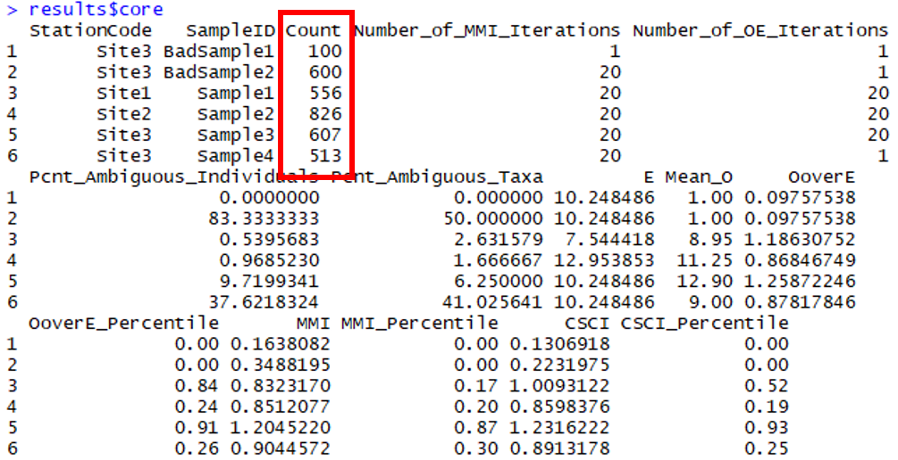
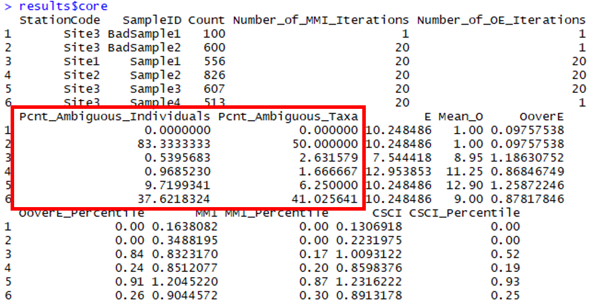

```{r, setup, echo = FALSE, message = FALSE, warning = FALSE}
knitr::opts_chunk$set(
  collapse = TRUE,
  warning = FALSE,
  message = FALSE,
  echo = FALSE,
  comment = "#>",
  fig.path = "../figures/"
)

library(here)

# # extract bib entries from online
# Jabbrev::bib_scrp(
#   here('analysis/paper', 'decision_framework_SOP.Rmd'),
#   here('analysis/paper', 'refs.bib'),
#   ext_bib = 'https://raw.githubusercontent.com/fawda123/refs/master/refs.bib'
# )

# # check spelling
# spelling::spell_check_files(here('analysis/paper', 'decision_framework_SOP.Rmd'))

devtools::load_all('.', quiet = T)
```

# Background

* CSCI is the foundation of stream bioassessment in CA
     * Robust as an assessment method
     * May not be reliable if standard sampling or procedures are not followed, or external events affect a sample
     * We need an approach to determine if a particular sample cannot be reliably used with the CSCI

* The landscape model (LSM) provides a context for CSCI scores
     * What are constraints and how are they determined with the LSM
     * How can priorities be defined with the LSM
     * When would an assessment from LSM be unreliable? 

* We need to validate the information for high priority sites
     * Does the constraint class defined by the landscape model reflect the actual landscape context for these sites?
     * Is the biological sample used to calculate the CSCI reliable and within the standard protocol for estimating a site score?
     * What data can we use and what questions can we ask to assess the validity of a bioassessment sample and stream class?

* Who this document is for
     * Resource managers in SGRRMP
     * Resource managers elsewhere that might use CSCI/LSM to prioritize and have similar needs when interpreting bioassessment data
     * Assumes familiarity with CSCI and LSM, including interpretation of standard output

* What this document provides
     * Checklist of questions to evaluate for considering validity of CSCI and LSM scores
     * Organized in hierarchy from low to high effort, i.e., desktop exercise to collection/eval of external data, including additional site visits
     * A decision-support tool to help gather evidence for judgement calls by managers
     
* What this document is not
     * Not a validation of the CSCI as an index - it is a validation of the sample
     * Not a validation of LSM as a model - it is a validation of the data used to define the class
     * No policy recommendations for considering a sample/score valid, this is part of normal QA/QC
     * Does not define what action is pursued once CSCI/LSM are validated

# Validation

## Workflow description

* What is validation? 
    * General process of confirming validity of CSCI score and LSM category for guiding management decisions
    * Validation is within a larger framework that begins with comparing CSCI scores to LSM classification and ends with a decision on how to proceed (e.g., rapid screening for causal assessment, accept as is, collect more data)

```{r, fig.cap="A simplified framework for validating CSCI and SCAPE information.", fig.height=3}
knitr::include_graphics('../figures/simp_temp.png')
```

* The workflow
    * Grey boxes: validation process
    * Green boxes: datasets
    * Pink boxes: decision nodes
    * Yellow boxes: validation outcomes

* Validation process
    * Evaluate both CSCI and LSM assessments
    * The assessment can be invalidated at any step, which may prompt collection of appropriate data
    * Validation priorities - consider the difficulty answering the question and the importance of the question (i.e., how badly does the information need to be verified to consider a score valid. 
    * Desktop validation - uses readily available data from CSCI output or SCAPE website, these are low effort questions
    * External validation - requires evaluation of external datasets, including supporting GIS data, field information, etc., these are high effort questions

```{r, fig.cap="A simplified framework for validating CSCI and SCAPE information.", fig.height=1}
knitr::include_graphics('../figures/validation_priority.png')
```

<!-- The following is a list of several questions to consider when validating a CSCI score.  Each question focuses on a specific issue that may influence a CSCI outside of the standard operating procedure for the index.  For each question, a description of the issue is provided, how might the issue affect the score, and what data are needed to answer the question.  The questions are also described as simple desktop evaluations (e.g., examination of the metadata that are included with standard CSCI output) or more challenging questions may require additional data (e.g., site visits) or analyses to fully evaluate. A CSCI score could be invalidated for one to any of the questions and it is up to the individual to determine when to stop considering additional questions.        -->

* Types of recommended and required data
    * CSCI QAQC info
    * LSM QAQC info, SCAPE eval
    * Supporting data (external GIS, field data, etc.)
    
* Decisions determine if you continue validation or reach a validation outcome

* Validations outcomes: What decisions do you make once CSCI/LSM are/aren't validated? 
    * The CSCI score is as expected or the site is otherwise low priority - continue baseline maintenance and monitoring
    * Validated 
         * Conduct RSCA
         * Other alternative action
    * Not validated for CSCI or LSM
         * trust results anyway
         * get more samples
         * visit site
         
## Data sources

List of resources to assist with building the validation tool set - can go here or in appendix.

### Metadata 

* CSCI metadata (consult CSCI SOP and package documentation)
* SCAPE website
* Reference site information

### Supporting data

* GIS data
  * StreamCat
  * NHD hydrography
  * Catchment/Watershed layers
  * LU/LC data - NLCD 2006, 2011, NAIP aerial imagery
  * GIS metrics for CSCI
  * Google imagery + time slider
* Field data
  * SWAMP, SMC, CEDEN 
* Local knowledge
  * Field notes
  * Site photos
* Additional external datasets
  * weather conditions (noaa.gov/weather)
  * Fire perimeters
  * Dredging (?)
  * Mining (?)
  * Timer harvest/silviculture (?)
    
## CSCI

### Phase 1 questions 

The phase 1 questions are high priority, meaning they can be answered with minimal effort (e.g, by consulting the CSCI metadata) and the outcome has high certainty (e.g., a CSCI score will be almost always be invalid if the results do not satisfy the question).

1) Is the sample count sufficient? 
  
Low sample counts may not provide a complete picture of the community that was present during sampling.  Macroinvertebrates data used to calculate the CSCI are based on a representative subsample of 600 individuals from the total sample for each site.  In general, sites where CSCI scores are based on substantially less than 600 individuals may be suspect.  

The index output that is generated by the CSCI calculator provides information that can be used to evaluate the sample count.  Specifically the "core" output contains a column for each CSCI sample for the sample count.  In the first row, we see that the first sample was based on only 100 organisms.  Therefore, we can assume that CSCI scores from the first sample are invalid.
   
```{r fig.cap = "CSCI metadata that can be evaluated from the standard results.  The first sample returns an invalid CSCI score because of a low sample count (in red)."}

```

There are no strict guidelines from the SWAMP program for how many samples are required, although 100 is wholly insufficient.  An analysis of the effect of systematically reducing the sample count well below 600 individuals for several sites is shown below.  

```{r smpeff, fig.cap = "Effects of reducing sample size on CSCI scores."}
knitr::include_graphics('../figures/summary_results.png')
```

Figure \@ref(fig:smpeff) was created by taking subsamples of the total sample size for six different sites with a range of CSCI scores (horizontal dashed lines in Figure \@ref(fig:smpeff)a).  For each sample count, 100 subsamples were randomly selected from the total and CSCI scores were summarized by the average and coefficient of variation.  Overall, reducing the sample size caused reductions in the CSCI scores, with the reductions increasing more quickly with smaller sample sizes.  Figure \@ref(fig:smpeff)b shows the relative change as a proportion from the actual CSCI score.  The CSCI score is within ten percent of the actual score with sample counts of around 250 or more.  CSCI scores were reduced by greater than ten percent of the actual score with lower sample counts, the exception being site 801M16861. The variation of CSCI scores for each sample count also increases with lower sample counts (Figure \@ref(fig:smpeff)c), although variation did not exceed ten percent until very low sample sizes (e.g., 150 or less).  

The following conclusions are made from Figure \@ref(fig:smpeff):

* CSCI scores are generally within ten percent of the actual with sample counts of 250 or more

* Sites with lower CSCI scores are more affected by lower sample counts, however; 

* Sites with low scores and very low richness are minimally affected by changes in sample counts (site 801M16861).

* Precision decreases with lower sample size, although variation is typically less than 10% of the true mean with sample sizes of 200 or more.

2) Are there many ambiguous individuals or taxa? 

Ambiguous individuals or taxa cannot be used for O/E calculations in the CSCI, and may distort calculations of some metrics. This might occur if, for example, a sample isn’t identified to the CSCI’s standard level of effort (SAFIT1a), or if the sample is dominated by immature or hard-to-identify taxa (e.g., early instar stoneflies) . In these cases, a lower sample count of unambiguous individuals is used to calculate CSCI scores, which may not reflect true site condition.

The taxonomic identifications for macroinvertebrate samples used to calculate the CSCI are compared against SAFIT's standard taxonomic effort (available at [https://safit.org/ste.html](https://safit.org/ste.html)).  The CSCI output returns information on the percentage of observations in a sample that do not conform to the SAFIT taxonomy, both as the percentage of **individuals** from the total count that are ambiguous and the percentage of **taxa** that are ambiguous.  Although no maximum number has been established by SWAMP, samples with high percentages may have invalid CSCI scores. 

```{r fig.cap = "CSCI metadata that can be evaluated from the standard results.  The second sample returns an invalid CSCI score because of many ambiguous individuals and taxa (in red)."}

```

3) Was the sample affected by unusual sampling conditions? 

CSCI scores may be invalid if the sample was affected by natural or temporary disturbances.  The SWAMP sampling protocol indicates that sampling should occur during normal, baseflow conditions.  Sampling outside of these conditions, even during the normal index period from May to September, may result in depressed CSCI scores.  Field notes may indicate if abnormal conditions were present.  External datasets, such as flow records or time and location of fire events, may also provide clues of abnormal conditions. Types of disturbances could include: 

1) Abnormal flow
     1) high flow after a rain event that can scour a stream channel
     1) high flow dam release or diversion
     1) low flow under drought conditions
1) Vector control operations at/upstream of a site or in the watershed
1) In channel vegetation management or debris removal 
1) Fire location and intensity

It is also important to note that the CSCI is sensitive to stressors that may be caused by unusual events and that the score is valid in these instances, although it is not representative of "normal" conditions.  Whether or not a CSCI score is valid after a temporary disturbance depends on the objective of the sampling.  If the sampling is meant to capture the effects of these events, then the score is more than likely valid.  However, if the objective is to evaluate "normal", long-term conditions at a site, then the score may not represent these baseline conditions.  In the latter case, field crews may be unaware of temporary events that can depress CSCI scores.  If there is reason to question a score based on an unusual sampling condition, external data must be consulted. Field notes may be the best source of information.

### Phase 2 questions    

1) Was the sample outside of the typical index period?

The SOP guidelines for field sampling of macroinvertebrates [@Ode16b] states the typical index period as being from __May__ through __September__ to characterize base flow conditions.  This period depends on the region, such that sampling can occur towards the earlier end of this range in southern California, and later in this range for higher latitudes.  Sampling that occurs outside of this range could produce a sample that is not representative of the macroinvertebrate community for which the CSCI is calculated.  Sample dates can be verified from the raw data used to calculate the CSCI.  However, published research has suggested that CSCI scores are relatively invariant to seasonal changes, so this question is giver a lower priority for validation. 

2) Does the site have a bad watershed delineation?

The CSCI requires data describing landscape characteristics of the watershed for a site.  These data are used to develop a prediction of the macroinvertebrate community that could be expected at the site under reference conditions.  A watershed delineation is required for a site to obtain these landscape data for the CSCI predictions. The CSCI interim instructions [@Mazor18b] describe in detail how these delineations can be created.  In short, a digital elevation model is used with the site's longitude/latitude to identify the area of land where all elevations are increasing and higher than the starting elevation of the site.  This watershed is then used to calculate landscape-level data needed for the CSCI, such as the total elevation range, average precipitation, and various soil characteristics.  An inaccurate representation of the watershed can produce inaccurate estimates of the landscape data used to calculate the CSCI.

The watershed delineation process is automated using standard geosptial software, with some intervention and manual inputs from the user.  In general, delineations will accurately represent the watershed at the site if: 

* The site location is spatially co-located with a stream reach, and

* The actual drainage area is well-represented by topography. 

For the first scenario, the site location is typically referenced by longitude/latitude coordinates.  For delineation, these coordinates must be spatially linked to a stream reach in a GIS.  These stream reaches are represented by the NHD-Plus dataset [@McKay12], which is a national-level product describing stream hydrography for the entire United States. The first step in the delineation is to "snap" the site location to the nearest stream stream reach.  If the site location is imprecise or was entered incorrectly, the snapping distance can be large.  Conversely, the stream reach in the NHD-Plus dataset may not accurately portray the true channel.  In either case, the resulting watershed will originate from a location that does not represent reality.  Visual assessment of the site location, the segment that was used for the delineation, and the snapping distance can provide clues about the quality of the delineation.  

For the second scenario, topographical characteristics of the landscape around a site can also affect the quality of the delineation.  In general, watershed boundaries are more easily identified at high gradient sites in hilly or mountainous areas where topographical variation is more pronounced.  Conversely, low gradient streams may have less accurate watershed delineations because it is more difficult to identify clear elevation differences that define drainage patterns.  The latter scenario is more common in coastal plains, plateaus, or other low elevation areas.  Developed landscapes also complicate watershed delineations because the natural flow of water may have been significantly altered.  In these cases, water may not follow strict topographical boundaries due to channelization or diversions. Overlaying the watershed delineation on aerial photos can provide clues about the effect of land use alteration on flow patterns and if the delineation is strongly driven by topography.   

[Streamstats](https://streamstats.usgs.gov/ss/)

```{r baddel, fig.cap = 'A good watershed delineation'}
knitr::include_graphics(here('analysis/figures', 'good_delin.PNG'))
```

```{r gooddel, fig.cap = 'A questionable watershed delineation'}
knitr::include_graphics(here('analysis/figures', 'bad_delin.PNG'))
```

3) Are there unusual settings where CSCI is known to give low scores?

There are few locations in California where the CSCI is known to give low scores, although in some settings the biological community is naturally low in diversity.  In these scenarios, the geological setting may be uncharacteristic of the region (e.g., unusual geology types with limited extent, [@Campbell09]) and can have an influence on the physical and chemical characteristics of the stream that then limits diversity of the biological community.  This confounds the ability of the CSCI to distinguish between natural and anthropogenic variation, resulting in unreliable scores.  

The simplest way to determine if a site represents an unusual setting is to evaluate the relevant pool of reference sites that apply to a site.  CSCI scores are determined using expectations from references sites that describe the expected community in the absence of anthropogenic stress.  The reference sites that have the largest weights in calculating the CSCI score are determined based on the most similar reference sites in a region for a site. The CSCI cannot adequately distinguish between anthropogenic and natural variation if these representative reference sites do not match well to the expected community at the test site.  In such cases, unusual geological settings may be a reasonable explanation for low CSCI scores.  Evaluating reference site pools with detailed geological maps may provide the necessary information to validate a CSCI score.


Data to evaluate

* Weather data
* Fire perimeters
* QA reports, CSCI metadata
* Field notes
* Upstream/downstream samples or nearby 
* ASCI, PHAB, CRAM, water quality observations
* Pictures
* Reference sites
* GIS data
* watershed data
* Degree of deviation from expectation

## SCAPE

### Phase 1 questions

1) Sampling reach is atypical of segment’s overall conditions (e.g., unconstrained surrounded by constrained)?

### Phase 2 questions

1) Land cover has changed?
2) Constraints not captured by model (e.g., fire impacts, dredging, mining)?
3) Channel has migrated from nominal location (NHD issues)?
4) Close to landscape model breakpoints?

Data to evaluate

* Satellite imagery
* Site photos
* Alternative land use/land cover data (2006, 2011 NLCD)
* PHAB data (metrics and field notes)
* CRAM
* Landscape stressors not characterized by StreamCat 
* Google images
* Site location relative to NHD segment
* Catchment size
* When is lu/lc change important?
* Reference GIS data

# High priority sites in SGR watershed

* 405CE0280, SMC00480, SMC00144, SMC02972, SMC04524, SMC06496
* Why are these high priority?
* Validate CSCI/LSM results for each using available data to demonstrate the process
* What conclusions are made?  

# References
