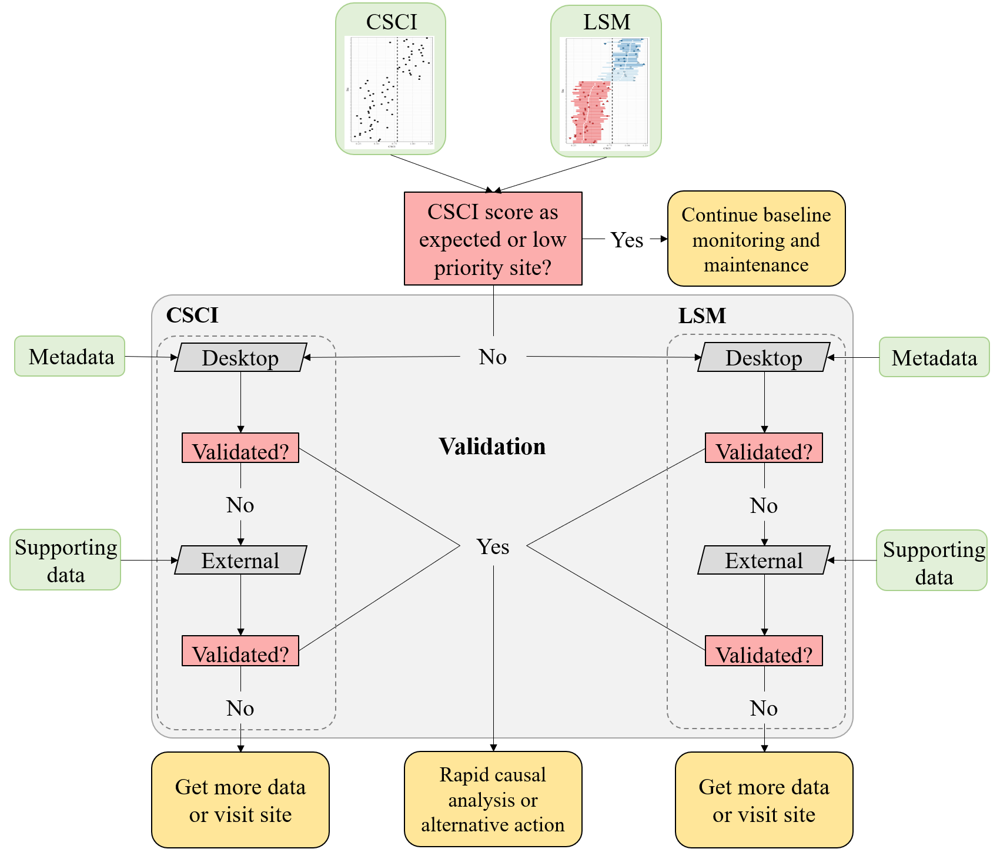

```{r, setup, echo = FALSE}
knitr::opts_chunk$set(
  collapse = TRUE,
  warning = FALSE,
  message = FALSE,
  echo = FALSE,
  comment = "#>",
  fig.path = "../figures/"
)

devtools::load_all('.', quiet = T)
```

# Background

* CSCI is the foundation of stream bioassessment in CA
     * Robust as an assessment method
     * May not be reliable if standard sampling or procedures are not followed, or external events affect a sample
     * We need an approach to determine if a particular sample cannot be reliably used with the CSCI

* The landscape model (LSM) provides a context for CSCI scores
     * What are constraints and how are they determined with the LSM
     * How can priorities be defined with the LSM
     * When would an assessment from LSM be unreliable? 

* We need to validate the information for high priority sites
     * Does the constraint class defined by the landscape model reflect the actual landscape context for these sites?
     * Is the biological sample used to calculate the CSCI reliable and within the standard protocol for estimating a site score?
     * What data can we use and what questions can we ask to assess the validity of a bioassessment sample and stream class?

* Who this document is for
     * Resource managers in SGRRMP
     * Resource managers elsewhere that might use CSCI/LSM to prioritize and have similar needs when interpreting bioassessment data
     * Assumes familiarity with CSCI and LSM, including interpretation of standard output

* What this document provides
     * Checklist of questions to evaluate for considering validity of CSCI and LSM scores
     * Organized in hierarchy from low to high effort, i.e., desktop exercise to collection/eval of external data, including additional site visits
     * A decision-support tool to help gather evidence for judgement calls by managers
     
* What this document is not
     * Not a validation of the CSCI as an index - it is a validation of the sample
     * Not a validation of LSM as a model - it is a validation of the data used to define the class
     * No policy recommendations for considering a sample/score valid, this is part of normal QA/QC
     * Does not define what action is pursued once CSCI/LSM are validated

# Validation

## Workflow description

* What is validation? 
    * General process of confirming validity of CSCI score and LSM category for guiding management decisions
    * Validation is within a larger framework that begins with comparing CSCI scores to LSM classification and ends with a decision on how to proceed (e.g., rapid screening for causal assessment, accept as is, collect more data)

```{r, fig.cap="A simplified framework for validating CSCI and SCAPE information.", fig.height=3}

```

* The workflow
    * Grey boxes: validation process
    * Green boxes: datasets
    * Pink boxes: decision nodes
    * Yellow boxes: validation outcomes

* Validation process
    * Evaluate both CSCI and LSM assessments
    * The assessment can be invalidated at any step, which may prompt collection of appropriate data
    * Desktop validation - uses readily available data from CSCI output or SCAPE website
    * External validation - requires evaluation of external datasets, including supporting GIS data, field information, etc.

* Types of recommended and required data
    * CSCI QAQC info
    * LSM QAQC info, SCAPE eval
    * Supporting data (external GIS, field data, etc.)
    
* Decisions determine if you continue validation or reach a validation outcome

* Validations outcomes: What decisions do you make once CSCI/LSM are/aren't validated? 
    * The CSCI score is as expected or the site is otherwise low priority - continue baseline maintenance and monitoring
    * Validated 
         * Conduct RSCA
         * Other alternative action
    * Not validated for CSCI or LSM
         * trust results anyway
         * get more samples
         * visit site
         
## Data sources

List of resources to assist with building the validation tool set - can go here or in appendix.

### Phase 1 data

* CSCI metadata (consult CSCI SOP and package documentation)
* SCAPE website
* Reference site information (most similar references sites to the test site, will have an R function for this)

### Phase 2 data

* GIS data
  * StreamCat
  * NHD hydrography
  * Catchment/Watershed layers
  * LU/LC data - NLCD 2006, 2011, NAIP aerial imagery
  * GIS metrics for CSCI
  * Google imagery + time slider
* Field data
  * SWAMP, SMC, CEDEN 
* Local knowledge
  * Field notes
  * Site photos
* Additional external datasets
  * weather conditions (noaa.gov/weather)
  * Fire perimeters
  * Dredging (?)
  * Mining (?)
  * Timer harvest/silviculture (?)
    
## CSCI

1) Is the sample count sufficient?
1) Are there many ambiguous individuals or taxa? 
1) Was the sample outside of the typical index period?
1) Was the sample affected by temporary disturbances?
1) Unusual sampling conditions (flow was too low/high for sample nets)?
1) Unusual settings where CSCI is known to give low scores?
1) Uncertainty in score with n = 1? Or high variability with repeat visits? Or score is very close to decision points (e.g., 0.77 or 0.80)?
1) Bad watershed delineation?

Data to evaluate

* Weather data
* Fire perimeters
* QA reports, CSCI metadata
* Field notes
* Upstream/downstream samples or nearby 
* ASCI, PHAB, CRAM, water quality observations
* Pictures
* Reference sites
* GIS data
* watershed data
* Degree of deviation from expectation

## SCAPE

1) Close to landscape model breakpoints?
1) Segment class is atypical of surrounding segments or landscape conditions (e.g., unconstrained surrounded by constrained)?
1) Channel has migrated from nominal location (NHD issues)?
1) Land cover has changed?
1) Constraints not captured by model (e.g., fire impacts, dredging, mining)?

Data to evaluate

* Satellite imagery
* Site photos
* Alternative land use/land cover data (2006, 2011 NLCD)
* PHAB data (metrics and field notes)
* CRAM
* Landscape stressors not characterized by StreamCat 
* Google images
* Site location relative to NHD segment
* Catchment size
* When is lu/lc change important?
* Reference GIS data

# High priority sites in SGR watershed

* 405CE0280, SMC00480, SMC00144, SMC02972, SMC04524, SMC06496
* Why are these high priority?
* Validate CSCI/LSM results for each using available data to demonstrate the process
* What conclusions are made?  
